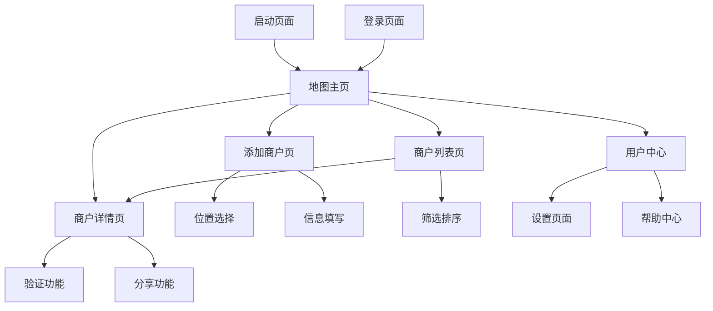

# Payments Maps Android应用 - 产品需求文档

## 1. 产品概述

Payments Maps Android应用是基于现有Web版本的原生Android应用，专为信用卡和支付爱好者设计的众包地图平台。
- 完全复刻Web版本的所有功能，包括商户标注、支付信息查询、用户认证等核心功能
- 采用Material You设计语言，提供符合Android原生体验的用户界面
- 针对移动端优化，提供更好的位置服务、离线功能和推送通知体验

## 2. 核心功能

### 2.1 用户角色

| 角色 | 注册方式 | 核心权限 |
|------|----------|----------|
| 普通用户 | Google账号、GitHub、LinuxDo等第三方登录 | 查看地图、标注商户、验证信息、收藏商户 |
| 认证用户 | 完成身份验证流程 | 享有普通用户权限，标注权重更高，可参与审核 |
| 管理员 | 系统分配权限 | 审核标注、管理用户、处理举报、数据管理 |

### 2.2 功能模块

我们的Android应用包含以下主要页面：
1. **地图主页**：Material You风格地图界面、位置服务、商户标记、智能搜索
2. **商户详情页**：详细信息展示、用户验证、评价系统、分享功能
3. **添加商户页**：位置选择、信息填写、图片上传、实时验证
4. **商户列表页**：列表视图、高级筛选、排序功能、快速操作
5. **用户中心**：个人资料、标注历史、收藏管理、设置选项
6. **登录注册页**：Material You登录界面、多种认证方式
7. **设置页面**：应用设置、隐私控制、通知管理、主题切换
8. **帮助中心**：使用指南、常见问题、反馈渠道

### 2.3 页面详情

| 页面名称 | 模块名称 | 功能描述 |
|----------|----------|----------|
| 地图主页 | 地图展示 | 使用Google Maps SDK，Material You风格地图控件，支持深色模式，动态颜色主题 |
| 地图主页 | 位置服务 | 原生位置权限管理，GPS和网络定位，位置历史记录，地理围栏功能 |
| 地图主页 | 商户搜索 | Material Design搜索栏，智能建议，语音搜索，搜索历史 |
| 地图主页 | 标记展示 | 自定义Marker设计，聚类显示，动画效果，信息窗口 |
| 商户详情页 | 信息展示 | Material Card布局，POS机信息，支付方式图标，营业时间 |
| 商户详情页 | 用户验证 | 浮动操作按钮，确认动画，验证统计，可信度指示器 |
| 商户详情页 | 评价系统 | 星级评分组件，评论列表，图片展示，举报功能 |
| 商户详情页 | 分享功能 | Android原生分享，深度链接，二维码生成，社交媒体集成 |
| 添加商户页 | 位置选择 | 交互式地图选择，地址自动补全，GPS定位，位置精度验证 |
| 添加商户页 | 信息填写 | Material表单组件，实时验证，自动保存，步骤指示器 |
| 添加商户页 | 图片上传 | 相机集成，图片压缩，多图上传，OCR识别POS机型号 |
| 商户列表页 | 列表展示 | RecyclerView优化，Material List Item，距离计算，加载动画 |
| 商户列表页 | 筛选排序 | Bottom Sheet筛选器，多条件排序，保存筛选偏好 |
| 用户中心 | 个人资料 | 头像上传，信息编辑，统计展示，成就系统 |
| 用户中心 | 标注历史 | 时间线展示，编辑删除，状态跟踪，数据导出 |
| 用户中心 | 收藏管理 | 分类管理，快速访问，同步功能，离线缓存 |
| 登录注册页 | 第三方登录 | OAuth集成，生物识别登录，自动登录，安全验证 |
| 设置页面 | 应用设置 | 主题切换，语言选择，缓存管理，数据同步 |
| 设置页面 | 隐私控制 | 权限管理，数据清理，隐私设置，GDPR合规 |
| 帮助中心 | 使用指南 | 交互式教程，视频指导，功能介绍，新手引导 |

## 3. 核心流程

**用户标注流程：**
用户发现可刷卡商户 → 打开应用（指纹/面部识别登录）→ 自动获取当前位置 → 点击浮动添加按钮 → 在地图上精确定位 → 填写商户信息 → 拍照上传验证 → 提交标注（推送通知确认）

**用户查找流程：**
用户打开应用 → 自动定位并显示附近商户 → 使用搜索或筛选功能 → 查看商户详情 → 验证信息或添加收藏 → 导航到商户位置

**信息验证流程：**
用户到达商户位置 → 查看商户详情 → 实地验证支付信息 → 点击验证按钮 → 可选添加照片证明 → 提交验证（获得积分奖励）

## 4. 用户界面设计

### 4.1 设计风格

- **Material You设计语言**：采用Android 12+的Material You设计系统
- **动态颜色主题**：根据用户壁纸自动生成主题色彩（#动态主色调）
- **深色模式支持**：完整的深色主题适配，跟随系统设置
- **按钮样式**：Material 3按钮规范，浮动操作按钮，触觉反馈
- **字体系统**：Roboto字体家族，支持可变字体，无障碍字体大小
- **布局风格**：Material Card设计，响应式布局，手势导航适配
- **图标风格**：Material Icons，矢量图标，自适应图标支持

### 4.2 页面设计概览

| 页面名称 | 模块名称 | UI元素 |
|----------|----------|--------|
| 地图主页 | 地图容器 | 全屏地图，Material搜索栏，浮动定位按钮，图层切换Chip |
| 地图主页 | 导航栏 | 透明状态栏，搜索栏，用户头像，设置图标 |
| 地图主页 | 底部导航 | Material Navigation Bar，地图/列表/收藏/我的四个标签 |
| 商户详情页 | 内容布局 | 滚动视图，Material Card，浮动操作按钮，分享按钮 |
| 商户详情页 | 信息卡片 | 商户名称，地址，支付方式Chip组，POS机信息Card |
| 添加商户页 | 表单设计 | 步骤指示器，Material文本框，图片上传区域，提交按钮 |
| 商户列表页 | 列表项 | Material List Item，距离Badge，评分星级，支付方式图标 |
| 用户中心 | 个人信息 | 大头像，用户名，统计卡片，设置列表 |
| 设置页面 | 设置项 | Material Switch，Preference样式，分组设计 |

### 4.3 响应式设计

- **多屏幕适配**：支持手机、平板、折叠屏设备
- **手势导航**：完整支持Android手势导航系统
- **无障碍功能**：TalkBack支持，高对比度模式，大字体适配
- **性能优化**：60fps流畅动画，内存优化，电池优化
- **离线功能**：地图缓存，数据同步，离线标注功能

### 4.4 Android特有功能

- **通知系统**：标注审核通知，附近新商户提醒，验证结果通知
- **小部件支持**：主屏幕小部件显示附近商户
- **快捷方式**：长按应用图标显示快速操作
- **分享集成**：Android原生分享，接收其他应用分享的位置
- **语音助手**：Google Assistant集成，语音搜索商户
- **生物识别**：指纹、面部识别快速登录
- **NFC功能**：NFC标签快速添加商户信息（可选）