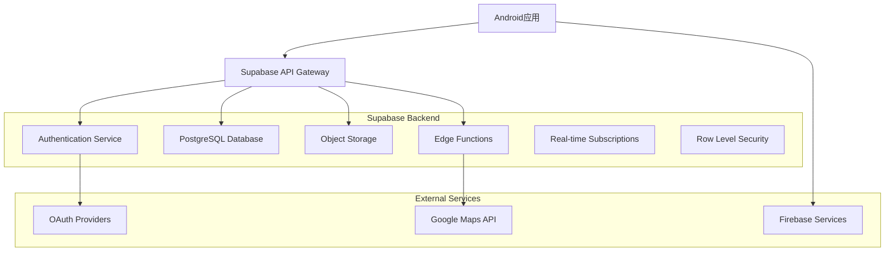
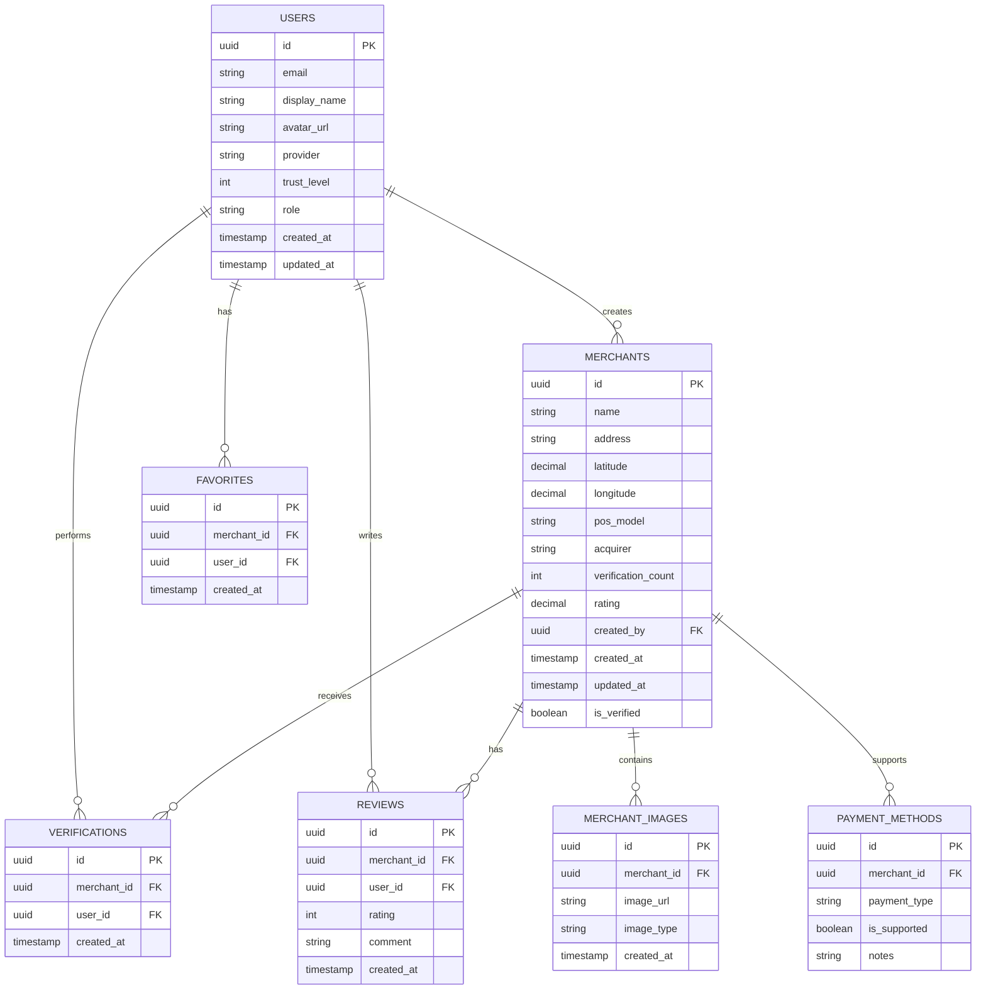

# Payments Maps Android应用 - 技术架构文档

## 1. 架构设计

```

### 7.4 位置服务集成
```kotlin
@Singleton
class LocationService @Inject constructor(
    @ApplicationContext private val context: Context,
    private val fusedLocationClient: FusedLocationProviderClient
) {
    suspend fun getCurrentLocation(): Result<LatLng> = suspendCancellableCoroutine { continuation ->
        if (ActivityCompat.checkSelfPermission(
                context,
                Manifest.permission.ACCESS_FINE_LOCATION
            ) != PackageManager.PERMISSION_GRANTED
        ) {
            continuation.resume(Result.failure(SecurityException("Location permission not granted")))
            return@suspendCancellableCoroutine
        }
        
        fusedLocationClient.lastLocation
            .addOnSuccessListener { location ->
                if (location != null) {
                    continuation.resume(Result.success(LatLng(location.latitude, location.longitude)))
                } else {
                    continuation.resume(Result.failure(Exception("Location not available")))
                }
            }
            .addOnFailureListener { exception ->
                continuation.resume(Result.failure(exception))
            }
    }
}
```

### 7.5 国际化支持 - 对应Web版React i18next
```kotlin
// 多语言资源管理
class LocalizationManager @Inject constructor(
    @ApplicationContext private val context: Context
) {
    // 支持的语言列表 - 与Web版一致
    enum class SupportedLanguage(val code: String, val displayName: String) {
        CHINESE("zh", "中文"),
        ENGLISH("en", "English"),
        RUSSIAN("ru", "Русский"),
        GERMAN("de", "Deutsch")
    }
    
    fun setLanguage(language: SupportedLanguage) {
        val locale = Locale(language.code)
        Locale.setDefault(locale)
        
        val config = context.resources.configuration
        config.setLocale(locale)
        context.createConfigurationContext(config)
        
        // 保存用户语言偏好
        saveLanguagePreference(language.code)
    }
    
    private fun saveLanguagePreference(languageCode: String) {
        val prefs = context.getSharedPreferences("app_prefs", Context.MODE_PRIVATE)
        prefs.edit().putString("selected_language", languageCode).apply()
    }
}
```

### 7.6 推送通知实现
```kotlin
@HiltAndroidApp
class PaymentsMapsApplication : Application() {
    override fun onCreate() {
        super.onCreate()
        createNotificationChannels()
    }
    
    private fun createNotificationChannels() {
        if (Build.VERSION.SDK_INT >= Build.VERSION_CODES.O) {
            val channels = listOf(
                NotificationChannel(
                    "merchant_updates",
                    "商户更新",
                    NotificationManager.IMPORTANCE_DEFAULT
                ),
                NotificationChannel(
                    "verification_results",
                    "验证结果",
                    NotificationManager.IMPORTANCE_HIGH
                )
            )
            
            val notificationManager = getSystemService(NotificationManager::class.java)
            channels.forEach { notificationManager.createNotificationChannel(it) }
        }
    }
}mermaid
graph TD
    A[Android应用] --> B[Presentation Layer]
    B --> C[Domain Layer]
    C --> D[Data Layer]
    D --> E[Supabase Backend]
    D --> F[Google Maps SDK]
    D --> G[本地数据库]
    
    subgraph "Presentation Layer (UI)"
        B1[Activities/Fragments]
        B2[Compose UI]
        B3[ViewModels]
        B4[Navigation Component]
    end
    
    subgraph "Domain Layer (业务逻辑)"
        C1[Use Cases]
        C2[Repository Interfaces]
        C3[Domain Models]
        C4[Business Rules]
    end
    
    subgraph "Data Layer (数据)"
        D1[Repository Implementations]
        D2[Remote Data Sources]
        D3[Local Data Sources]
        D4[Data Mappers]
    end
    
    subgraph "External Services"
        E[Supabase]
        F[Google Maps]
        H[Firebase Services]
        I[OAuth Providers]
    end
```

## 2. 技术描述

- **开发语言**: Kotlin 100% (与Web版TypeScript对应)
- **UI框架**: Jetpack Compose + Material 3 Expressive
- **设计系统**: Material Design 3 Expressive (M3E) - 最新研究支持的设计系统
- **架构模式**: Clean Architecture + MVVM (对应Web版React架构)
- **状态管理**: Compose State + ViewModel (对应Web版Zustand)
- **依赖注入**: Hilt (Dagger)
- **网络请求**: Retrofit + OkHttp + Supabase Kotlin SDK
- **本地数据库**: Room Database (对应Web版本地存储)
- **异步处理**: Kotlin Coroutines + Flow
- **图片加载**: Coil (对应Web版图片优化)
- **地图服务**: Google Maps SDK for Android (对应Web版Amap)
- **认证服务**: Supabase Auth (与Web版一致的OAuth提供商)
- **国际化**: Android Resources + Locale (对应Web版React i18next)
- **动画库**: Compose Animation + Lottie (对应Web版Framer Motion)
- **推送通知**: Firebase Cloud Messaging
- **崩溃监控**: Firebase Crashlytics
- **分析统计**: Firebase Analytics

## 3. 路由定义

| 路由/Screen | 用途 | Navigation参数 |
|-------------|------|----------------|
| SplashScreen | 启动页面，应用初始化和用户认证检查 | 无 |
| LoginScreen | 登录页面，多种第三方登录方式 | 无 |
| MapScreen | 地图主页，显示商户位置和搜索功能 | 无 |
| MerchantDetailScreen | 商户详情页，显示POS机信息和用户验证 | merchantId: String |
| AddMerchantScreen | 添加商户页面，位置选择和信息填写 | initialLocation: LatLng? |
| MerchantListScreen | 商户列表页，列表视图和筛选功能 | 无 |
| ProfileScreen | 用户中心，个人信息和标注历史 | 无 |
| SettingsScreen | 设置页面，应用配置和隐私控制 | 无 |
| HelpScreen | 帮助中心，使用指南和常见问题 | 无 |
| EditMerchantScreen | 编辑商户信息页面 | merchantId: String |
| FavoritesScreen | 收藏商户页面 | 无 |
| HistoryScreen | 标注历史页面 | 无 |
| OnboardingScreen | 新手引导页面 | 无 |

## 4. API定义

### 4.1 核心API

**用户认证相关**
```kotlin
// Supabase Auth集成
interface AuthRepository {
    suspend fun signInWithGoogle(): Result<User>
    suspend fun signInWithGitHub(): Result<User>
    suspend fun signInWithLinuxDo(): Result<User>
    suspend fun signOut(): Result<Unit>
    suspend fun getCurrentUser(): User?
    fun observeAuthState(): Flow<User?>
}
```

**商户数据相关**
```kotlin
interface MerchantRepository {
    suspend fun getMerchantsInBounds(
        northEast: LatLng,
        southWest: LatLng
    ): Result<List<Merchant>>
    
    suspend fun getMerchantById(id: String): Result<Merchant>
    
    suspend fun addMerchant(merchant: Merchant): Result<String>
    
    suspend fun updateMerchant(merchant: Merchant): Result<Unit>
    
    suspend fun deleteMerchant(id: String): Result<Unit>
    
    suspend fun verifyMerchant(merchantId: String): Result<Unit>
    
    suspend fun searchMerchants(query: String): Result<List<Merchant>>
}
```

**位置服务相关**
```kotlin
interface LocationRepository {
    suspend fun getCurrentLocation(): Result<LatLng>
    suspend fun requestLocationPermission(): Boolean
    fun observeLocationUpdates(): Flow<LatLng>
    suspend fun geocodeAddress(address: String): Result<LatLng>
    suspend fun reverseGeocode(location: LatLng): Result<String>
}
```

### 4.2 数据模型

```kotlin
// 对应Web版pos_machines表结构
@Serializable
data class POSMachine(
    val id: String = "",
    val name: String,
    val address: String,
    val latitude: Double,
    val longitude: Double,
    val posModel: String? = null,
    val acquirer: String? = null,
    val paymentMethods: List<PaymentMethod> = emptyList(),
    val images: List<String> = emptyList(),
    val verificationCount: Int = 0,
    val rating: Float = 0f,
    val createdBy: String,
    val createdAt: String,
    val updatedAt: String,
    val isVerified: Boolean = false,
    val brandId: String? = null,
    val externalLinks: List<ExternalLink> = emptyList(),
    // 对应Web版JSONB字段的灵活性
    val metadata: Map<String, Any> = emptyMap()
)

@Serializable
data class PaymentMethod(
    val type: PaymentType,
    val isSupported: Boolean,
    val notes: String? = null
)

enum class PaymentType {
    FOREIGN_CARD,
    APPLE_PAY,
    GOOGLE_PAY,
    CONTACTLESS,
    UNIONPAY,
    ALIPAY,
    WECHAT_PAY
}

@Serializable
data class User(
    val id: String,
    val email: String,
    val displayName: String,
    val avatarUrl: String? = null,
    val provider: String,
    val trustLevel: Int = 0,
    val role: UserRole = UserRole.USER,
    val createdAt: String,
    val updatedAt: String
)

enum class UserRole {
    USER, VERIFIED_USER, MODERATOR, ADMIN
}
```

## 5. 服务器架构图



## 6. 数据模型

### 6.1 数据模型定义



### 6.2 数据定义语言

**用户表 (users)**
```sql
-- 创建用户表
CREATE TABLE users (
    id UUID PRIMARY KEY DEFAULT gen_random_uuid(),
    email VARCHAR(255) UNIQUE NOT NULL,
    display_name VARCHAR(100) NOT NULL,
    avatar_url TEXT,
    provider VARCHAR(50) NOT NULL,
    trust_level INTEGER DEFAULT 0,
    role VARCHAR(20) DEFAULT 'user' CHECK (role IN ('user', 'verified_user', 'moderator', 'admin')),
    created_at TIMESTAMP WITH TIME ZONE DEFAULT NOW(),
    updated_at TIMESTAMP WITH TIME ZONE DEFAULT NOW()
);

-- 创建索引
CREATE INDEX idx_users_email ON users(email);
CREATE INDEX idx_users_role ON users(role);
```

**商户表 (merchants)**
```sql
-- 创建商户表
CREATE TABLE merchants (
    id UUID PRIMARY KEY DEFAULT gen_random_uuid(),
    name VARCHAR(255) NOT NULL,
    address TEXT NOT NULL,
    latitude DECIMAL(10, 8) NOT NULL,
    longitude DECIMAL(11, 8) NOT NULL,
    pos_model VARCHAR(100),
    acquirer VARCHAR(100),
    verification_count INTEGER DEFAULT 0,
    rating DECIMAL(3, 2) DEFAULT 0.0,
    created_by UUID REFERENCES users(id),
    created_at TIMESTAMP WITH TIME ZONE DEFAULT NOW(),
    updated_at TIMESTAMP WITH TIME ZONE DEFAULT NOW(),
    is_verified BOOLEAN DEFAULT FALSE
);

-- 创建地理位置索引
CREATE INDEX idx_merchants_location ON merchants USING GIST (point(longitude, latitude));
CREATE INDEX idx_merchants_created_by ON merchants(created_by);
CREATE INDEX idx_merchants_verification_count ON merchants(verification_count DESC);
```

**支付方式表 (payment_methods)**
```sql
-- 创建支付方式表
CREATE TABLE payment_methods (
    id UUID PRIMARY KEY DEFAULT gen_random_uuid(),
    merchant_id UUID REFERENCES merchants(id) ON DELETE CASCADE,
    payment_type VARCHAR(50) NOT NULL CHECK (payment_type IN (
        'foreign_card', 'apple_pay', 'google_pay', 'contactless', 
        'unionpay', 'alipay', 'wechat_pay'
    )),
    is_supported BOOLEAN NOT NULL,
    notes TEXT
);

-- 创建索引
CREATE INDEX idx_payment_methods_merchant_id ON payment_methods(merchant_id);
CREATE INDEX idx_payment_methods_type ON payment_methods(payment_type);
```

**验证表 (verifications)**
```sql
-- 创建验证表
CREATE TABLE verifications (
    id UUID PRIMARY KEY DEFAULT gen_random_uuid(),
    merchant_id UUID REFERENCES merchants(id) ON DELETE CASCADE,
    user_id UUID REFERENCES users(id),
    created_at TIMESTAMP WITH TIME ZONE DEFAULT NOW(),
    UNIQUE(merchant_id, user_id)
);

-- 创建索引
CREATE INDEX idx_verifications_merchant_id ON verifications(merchant_id);
CREATE INDEX idx_verifications_user_id ON verifications(user_id);
```

**收藏表 (favorites)**
```sql
-- 创建收藏表
CREATE TABLE favorites (
    id UUID PRIMARY KEY DEFAULT gen_random_uuid(),
    merchant_id UUID REFERENCES merchants(id) ON DELETE CASCADE,
    user_id UUID REFERENCES users(id),
    created_at TIMESTAMP WITH TIME ZONE DEFAULT NOW(),
    UNIQUE(merchant_id, user_id)
);

-- 创建索引
CREATE INDEX idx_favorites_user_id ON favorites(user_id);
CREATE INDEX idx_favorites_merchant_id ON favorites(merchant_id);
```

**评价表 (reviews)**
```sql
-- 创建评价表
CREATE TABLE reviews (
    id UUID PRIMARY KEY DEFAULT gen_random_uuid(),
    merchant_id UUID REFERENCES merchants(id) ON DELETE CASCADE,
    user_id UUID REFERENCES users(id),
    rating INTEGER CHECK (rating >= 1 AND rating <= 5),
    comment TEXT,
    created_at TIMESTAMP WITH TIME ZONE DEFAULT NOW(),
    UNIQUE(merchant_id, user_id)
);

-- 创建索引
CREATE INDEX idx_reviews_merchant_id ON reviews(merchant_id);
CREATE INDEX idx_reviews_user_id ON reviews(user_id);
CREATE INDEX idx_reviews_rating ON reviews(rating DESC);
```

**商户图片表 (merchant_images)**
```sql
-- 创建商户图片表
CREATE TABLE merchant_images (
    id UUID PRIMARY KEY DEFAULT gen_random_uuid(),
    merchant_id UUID REFERENCES merchants(id) ON DELETE CASCADE,
    image_url TEXT NOT NULL,
    image_type VARCHAR(20) CHECK (image_type IN ('pos_machine', 'storefront', 'receipt')),
    created_at TIMESTAMP WITH TIME ZONE DEFAULT NOW()
);

-- 创建索引
CREATE INDEX idx_merchant_images_merchant_id ON merchant_images(merchant_id);
```

**Row Level Security (RLS) 策略**
```sql
-- 启用RLS
ALTER TABLE merchants ENABLE ROW LEVEL SECURITY;
ALTER TABLE payment_methods ENABLE ROW LEVEL SECURITY;
ALTER TABLE verifications ENABLE ROW LEVEL SECURITY;
ALTER TABLE favorites ENABLE ROW LEVEL SECURITY;
ALTER TABLE reviews ENABLE ROW LEVEL SECURITY;
ALTER TABLE merchant_images ENABLE ROW LEVEL SECURITY;

-- 商户表策略
CREATE POLICY "Anyone can view merchants" ON merchants FOR SELECT USING (true);
CREATE POLICY "Authenticated users can insert merchants" ON merchants FOR INSERT WITH CHECK (auth.role() = 'authenticated');
CREATE POLICY "Users can update own merchants" ON merchants FOR UPDATE USING (auth.uid() = created_by);
CREATE POLICY "Users can delete own merchants" ON merchants FOR DELETE USING (auth.uid() = created_by);

-- 支付方式表策略
CREATE POLICY "Anyone can view payment methods" ON payment_methods FOR SELECT USING (true);
CREATE POLICY "Authenticated users can manage payment methods" ON payment_methods FOR ALL USING (auth.role() = 'authenticated');

-- 验证表策略
CREATE POLICY "Anyone can view verifications" ON verifications FOR SELECT USING (true);
CREATE POLICY "Authenticated users can insert verifications" ON verifications FOR INSERT WITH CHECK (auth.role() = 'authenticated');

-- 收藏表策略
CREATE POLICY "Users can view own favorites" ON favorites FOR SELECT USING (auth.uid() = user_id);
CREATE POLICY "Users can manage own favorites" ON favorites FOR ALL USING (auth.uid() = user_id);

-- 评价表策略
CREATE POLICY "Anyone can view reviews" ON reviews FOR SELECT USING (true);
CREATE POLICY "Authenticated users can insert reviews" ON reviews FOR INSERT WITH CHECK (auth.role() = 'authenticated');
CREATE POLICY "Users can update own reviews" ON reviews FOR UPDATE USING (auth.uid() = user_id);
```

## 7. Material Design 3 Expressive 实现

### 7.1 Material 3 Expressive 主题系统
```kotlin
// Material 3 Expressive 动态颜色主题
@Composable
fun PaymentsMapsTheme(
    darkTheme: Boolean = isSystemInDarkTheme(),
    dynamicColor: Boolean = true,
    content: @Composable () -> Unit
) {
    val colorScheme = when {
        dynamicColor && Build.VERSION.SDK_INT >= Build.VERSION_CODES.S -> {
            val context = LocalContext.current
            if (darkTheme) dynamicDarkColorScheme(context) else dynamicLightColorScheme(context)
        }
        darkTheme -> ExpressiveDarkColorScheme
        else -> ExpressiveLightColorScheme
    }
    
    // Material 3 Expressive 深度色调调色板
    val expressiveColorScheme = colorScheme.copy(
        // 扩展的色彩表达机会
        secondary = colorScheme.secondary,
        tertiary = colorScheme.tertiary,
        // 新的表面颜色变体
        surfaceVariant = colorScheme.surfaceVariant,
        surfaceDim = colorScheme.surfaceDim,
        surfaceBright = colorScheme.surfaceBright
    )
    
    MaterialTheme(
        colorScheme = expressiveColorScheme,
        typography = ExpressiveTypography,
        shapes = ExpressiveShapes,
        content = content
    )
}

// Material 3 Expressive 圆角设计
val ExpressiveShapes = Shapes(
    extraSmall = RoundedCornerShape(4.dp),
    small = RoundedCornerShape(8.dp),
    medium = RoundedCornerShape(12.dp),
    large = RoundedCornerShape(16.dp),
    extraLarge = RoundedCornerShape(28.dp)
)

// Material 3 Expressive 可变字体轴
val ExpressiveTypography = Typography(
    displayLarge = TextStyle(
        fontFamily = FontFamily.Default,
        fontWeight = FontWeight.Normal,
        fontSize = 57.sp,
        lineHeight = 64.sp,
        letterSpacing = (-0.25).sp,
        fontFeatureSettings = "'wght' 400"
    ),
    // 更多表达性字体样式...
)
```

### 7.2 Material 3 Expressive 核心组件
```kotlin
// 表达性浮动操作按钮 - 对应Web版添加商户功能
@Composable
fun ExpressiveFloatingActionButton(
    onClick: () -> Unit,
    modifier: Modifier = Modifier,
    expanded: Boolean = false
) {
    ExtendedFloatingActionButton(
        onClick = onClick,
        modifier = modifier
            .animateContentSize() // 流畅的尺寸变化动画
            .shadow(
                elevation = 6.dp,
                shape = MaterialTheme.shapes.large,
                ambientColor = MaterialTheme.colorScheme.primary.copy(alpha = 0.1f)
            ),
        containerColor = MaterialTheme.colorScheme.primaryContainer,
        contentColor = MaterialTheme.colorScheme.onPrimaryContainer,
        shape = MaterialTheme.shapes.large // M3E 圆角设计
    ) {
        AnimatedVisibility(
            visible = expanded,
            enter = slideInHorizontally() + fadeIn(),
            exit = slideOutHorizontally() + fadeOut()
        ) {
            Icon(
                imageVector = Icons.Default.Add,
                contentDescription = "添加商户",
                modifier = Modifier.padding(end = 8.dp)
            )
        }
        Text(
            text = if (expanded) "添加商户" else "+",
            style = MaterialTheme.typography.labelLarge
        )
    }
}

// 表达性卡片组件 - 对应Web版商户信息卡片
@Composable
fun ExpressiveMerchantCard(
    posMachine: POSMachine,
    onClick: () -> Unit,
    modifier: Modifier = Modifier
) {
    Card(
        onClick = onClick,
        modifier = modifier
            .fillMaxWidth()
            .animateContentSize()
            .padding(horizontal = 16.dp, vertical = 8.dp),
        shape = MaterialTheme.shapes.large, // M3E 圆角设计
        colors = CardDefaults.cardColors(
            containerColor = MaterialTheme.colorScheme.surfaceVariant,
            contentColor = MaterialTheme.colorScheme.onSurfaceVariant
        ),
        elevation = CardDefaults.cardElevation(
            defaultElevation = 2.dp,
            pressedElevation = 8.dp // 表达性深度变化
        )
    ) {
        Column(
            modifier = Modifier.padding(16.dp)
        ) {
            // 商户名称和验证状态
            Row(
                modifier = Modifier.fillMaxWidth(),
                horizontalArrangement = Arrangement.SpaceBetween,
                verticalAlignment = Alignment.CenterVertically
            ) {
                Text(
                    text = posMachine.name,
                    style = MaterialTheme.typography.headlineSmall,
                    color = MaterialTheme.colorScheme.onSurface
                )
                if (posMachine.isVerified) {
                    AssistChip(
                        onClick = { },
                        label = { Text("已验证") },
                        leadingIcon = {
                            Icon(
                                imageVector = Icons.Default.Verified,
                                contentDescription = "已验证",
                                tint = MaterialTheme.colorScheme.primary
                            )
                        },
                        colors = AssistChipDefaults.assistChipColors(
                            containerColor = MaterialTheme.colorScheme.primaryContainer
                        )
                    )
                }
            }
            
            Spacer(modifier = Modifier.height(8.dp))
            
            // 地址信息
            Text(
                text = posMachine.address,
                style = MaterialTheme.typography.bodyMedium,
                color = MaterialTheme.colorScheme.onSurfaceVariant
            )
            
            Spacer(modifier = Modifier.height(12.dp))
            
            // 支付方式 Chip 组
            LazyRow(
                horizontalArrangement = Arrangement.spacedBy(8.dp)
            ) {
                items(posMachine.paymentMethods) { method ->
                    FilterChip(
                        selected = method.isSupported,
                        onClick = { },
                        label = { Text(method.type.name) },
                        colors = FilterChipDefaults.filterChipColors(
                            selectedContainerColor = MaterialTheme.colorScheme.secondaryContainer
                        )
                    )
                }
            }
        }
    }
}

// 表达性导航栏 - 对应Web版底部导航
@Composable
fun ExpressiveNavigationBar(
    selectedTab: Int,
    onTabSelected: (Int) -> Unit,
    modifier: Modifier = Modifier
) {
    NavigationBar(
        modifier = modifier,
        containerColor = MaterialTheme.colorScheme.surfaceContainer,
        contentColor = MaterialTheme.colorScheme.onSurface
    ) {
        val tabs = listOf(
            Triple(Icons.Default.Map, "地图", "map"),
            Triple(Icons.Default.List, "列表", "list"),
            Triple(Icons.Default.Favorite, "收藏", "favorites"),
            Triple(Icons.Default.Person, "我的", "profile")
        )
        
        tabs.forEachIndexed { index, (icon, label, _) ->
            NavigationBarItem(
                selected = selectedTab == index,
                onClick = { onTabSelected(index) },
                icon = {
                    Icon(
                        imageVector = icon,
                        contentDescription = label,
                        modifier = Modifier.animateContentSize()
                    )
                },
                label = {
                    Text(
                        text = label,
                        style = MaterialTheme.typography.labelMedium
                    )
                },
                colors = NavigationBarItemDefaults.colors(
                    selectedIconColor = MaterialTheme.colorScheme.onSecondaryContainer,
                    selectedTextColor = MaterialTheme.colorScheme.onSecondaryContainer,
                    indicatorColor = MaterialTheme.colorScheme.secondaryContainer
                )
            )
        }
    }
}
```

### 7.3 表达性动画和交互
```kotlin
// 流畅的页面转场动画 - 对应Web版Framer Motion
@Composable
fun ExpressivePageTransition(
    targetState: String,
    content: @Composable (String) -> Unit
) {
    AnimatedContent(
        targetState = targetState,
        transitionSpec = {
            // Material 3 Expressive 强调的流畅转场
            slideIntoContainer(
                towards = AnimatedContentTransitionScope.SlideDirection.Left,
                animationSpec = tween(
                    durationMillis = 300,
                    easing = FastOutSlowInEasing
                )
            ) togetherWith slideOutOfContainer(
                towards = AnimatedContentTransitionScope.SlideDirection.Left,
                animationSpec = tween(
                    durationMillis = 300,
                    easing = FastOutSlowInEasing
                )
            )
        },
        label = "page_transition"
    ) { page ->
        content(page)
    }
}

// 表达性加载状态 - 对应Web版加载动画
@Composable
fun ExpressiveLoadingIndicator(
    modifier: Modifier = Modifier,
    message: String = "加载中..."
) {
    Column(
        modifier = modifier.fillMaxSize(),
        horizontalAlignment = Alignment.CenterHorizontally,
        verticalArrangement = Arrangement.Center
    ) {
        // Material 3 Expressive 的动态加载指示器
        CircularProgressIndicator(
            modifier = Modifier
                .size(48.dp)
                .animateContentSize(),
            color = MaterialTheme.colorScheme.primary,
            strokeWidth = 4.dp,
            trackColor = MaterialTheme.colorScheme.surfaceVariant
        )
        
        Spacer(modifier = Modifier.height(16.dp))
        
        Text(
            text = message,
            style = MaterialTheme.typography.bodyLarge,
            color = MaterialTheme.colorScheme.onSurfaceVariant,
            modifier = Modifier.animateContentSize()
        )
    }
}

// 表达性搜索栏 - 对应Web版搜索功能
@OptIn(ExperimentalMaterial3Api::class)
@Composable
fun ExpressiveSearchBar(
    query: String,
    onQueryChange: (String) -> Unit,
    onSearch: (String) -> Unit,
    active: Boolean,
    onActiveChange: (Boolean) -> Unit,
    modifier: Modifier = Modifier,
    placeholder: String = "搜索商户..."
) {
    SearchBar(
        query = query,
        onQueryChange = onQueryChange,
        onSearch = onSearch,
        active = active,
        onActiveChange = onActiveChange,
        modifier = modifier
            .fillMaxWidth()
            .padding(horizontal = if (active) 0.dp else 16.dp)
            .animateContentSize(),
        shape = MaterialTheme.shapes.large,
        colors = SearchBarDefaults.colors(
            containerColor = MaterialTheme.colorScheme.surfaceContainer,
            dividerColor = MaterialTheme.colorScheme.outline
        ),
        placeholder = {
            Text(
                text = placeholder,
                style = MaterialTheme.typography.bodyLarge
            )
        },
        leadingIcon = {
            Icon(
                imageVector = Icons.Default.Search,
                contentDescription = "搜索",
                tint = MaterialTheme.colorScheme.onSurfaceVariant
            )
        },
        trailingIcon = if (query.isNotEmpty()) {
            {
                IconButton(
                    onClick = { onQueryChange("") }
                ) {
                    Icon(
                        imageVector = Icons.Default.Clear,
                        contentDescription = "清除",
                        tint = MaterialTheme.colorScheme.onSurfaceVariant
                    )
                }
            }
        } else null
    ) {
        // 搜索建议内容
    }
}

// 状态管理 - 对应Web版Zustand
@Stable
class ExpressiveAppState {
    var currentRoute by mutableStateOf("map")
        private set
    
    var isLoading by mutableStateOf(false)
        private set
    
    var searchQuery by mutableStateOf("")
        private set
    
    fun navigateTo(route: String) {
        currentRoute = route
    }
    
    fun setLoading(loading: Boolean) {
        isLoading = loading
    }
    
    fun updateSearchQuery(query: String) {
        searchQuery = query
    }
}

@Composable
fun rememberExpressiveAppState(): ExpressiveAppState {
    return remember { ExpressiveAppState() }
}
```