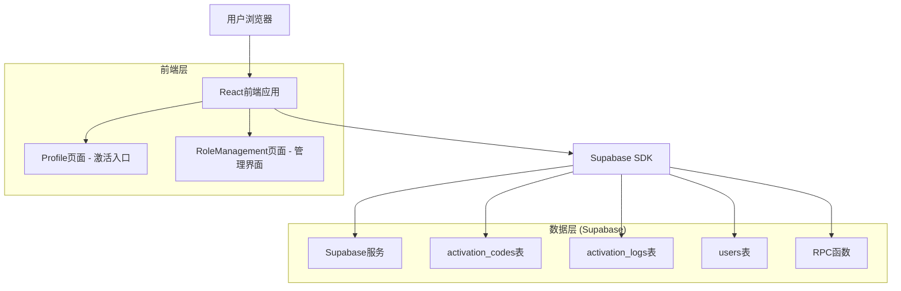
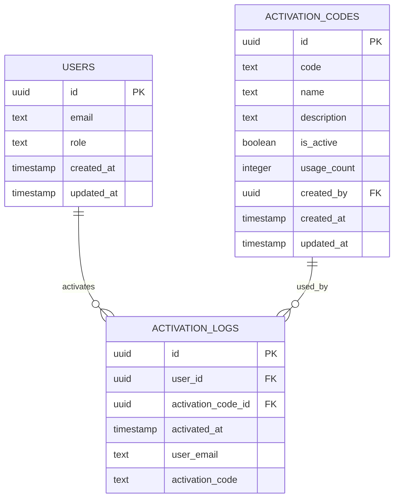

# Beta用户权限自助激活功能技术架构文档

## 1. 架构设计



## 2. 技术描述

- 前端: React@18 + TypeScript + Tailwind CSS + Vite
- 后端: Supabase (PostgreSQL + RPC函数)
- 认证: Supabase Auth
- UI组件: 自定义组件库

## 3. 路由定义

| 路由 | 用途 |
|------|------|
| /profile | 用户个人资料页面，包含"激活Beta权益"入口 |
| /role-management | 角色管理页面，包含激活码管理功能 |

## 4. API定义

### 4.1 核心RPC函数

**生成激活码**
```sql
generate_activation_code(code_name text, code_description text)
```

参数:
| 参数名 | 参数类型 | 是否必需 | 描述 |
|--------|----------|----------|------|
| code_name | text | true | 激活码名称 |
| code_description | text | false | 激活码描述 |

返回:
| 参数名 | 参数类型 | 描述 |
|--------|----------|------|
| code | text | 生成的激活码 |
| id | uuid | 激活码ID |

**激活Beta权限**
```sql
activate_beta_permission(activation_code text)
```

参数:
| 参数名 | 参数类型 | 是否必需 | 描述 |
|--------|----------|----------|------|
| activation_code | text | true | 用户输入的激活码 |

返回:
| 参数名 | 参数类型 | 描述 |
|--------|----------|------|
| success | boolean | 激活是否成功 |
| message | text | 结果消息 |

**停用激活码**
```sql
deactivate_activation_code(code_id uuid)
```

参数:
| 参数名 | 参数类型 | 是否必需 | 描述 |
|--------|----------|----------|------|
| code_id | uuid | true | 激活码ID |

### 4.2 数据表查询

**查询激活码列表**
```sql
SELECT * FROM activation_codes ORDER BY created_at DESC
```

**查询激活日志**
```sql
SELECT * FROM activation_logs ORDER BY activated_at DESC
```

## 5. 数据模型

### 5.1 数据模型定义



### 5.2 数据定义语言

**激活码表 (activation_codes)**
```sql
CREATE TABLE activation_codes (
    id UUID PRIMARY KEY DEFAULT gen_random_uuid(),
    code TEXT UNIQUE NOT NULL,
    name TEXT NOT NULL,
    description TEXT,
    is_active BOOLEAN DEFAULT true,
    usage_count INTEGER DEFAULT 0,
    created_by UUID REFERENCES auth.users(id),
    created_at TIMESTAMP WITH TIME ZONE DEFAULT NOW(),
    updated_at TIMESTAMP WITH TIME ZONE DEFAULT NOW()
);

-- 创建索引
CREATE INDEX idx_activation_codes_code ON activation_codes(code);
CREATE INDEX idx_activation_codes_is_active ON activation_codes(is_active);
CREATE INDEX idx_activation_codes_created_by ON activation_codes(created_by);

-- 行级安全策略
ALTER TABLE activation_codes ENABLE ROW LEVEL SECURITY;

CREATE POLICY "管理员可以查看所有激活码" ON activation_codes
    FOR SELECT USING (
        EXISTS (
            SELECT 1 FROM users 
            WHERE users.id = auth.uid() 
            AND users.role IN ('admin', 'super_admin')
        )
    );

CREATE POLICY "管理员可以创建激活码" ON activation_codes
    FOR INSERT WITH CHECK (
        EXISTS (
            SELECT 1 FROM users 
            WHERE users.id = auth.uid() 
            AND users.role IN ('admin', 'super_admin')
        )
    );

CREATE POLICY "管理员可以更新激活码" ON activation_codes
    FOR UPDATE USING (
        EXISTS (
            SELECT 1 FROM users 
            WHERE users.id = auth.uid() 
            AND users.role IN ('admin', 'super_admin')
        )
    );
```

**激活日志表 (activation_logs)**
```sql
CREATE TABLE activation_logs (
    id UUID PRIMARY KEY DEFAULT gen_random_uuid(),
    user_id UUID REFERENCES auth.users(id),
    activation_code_id UUID REFERENCES activation_codes(id),
    activated_at TIMESTAMP WITH TIME ZONE DEFAULT NOW(),
    user_email TEXT NOT NULL,
    activation_code TEXT NOT NULL
);

-- 创建索引
CREATE INDEX idx_activation_logs_user_id ON activation_logs(user_id);
CREATE INDEX idx_activation_logs_activation_code_id ON activation_logs(activation_code_id);
CREATE INDEX idx_activation_logs_activated_at ON activation_logs(activated_at DESC);

-- 行级安全策略
ALTER TABLE activation_logs ENABLE ROW LEVEL SECURITY;

CREATE POLICY "管理员可以查看所有激活日志" ON activation_logs
    FOR SELECT USING (
        EXISTS (
            SELECT 1 FROM users 
            WHERE users.id = auth.uid() 
            AND users.role IN ('admin', 'super_admin')
        )
    );

CREATE POLICY "系统可以插入激活日志" ON activation_logs
    FOR INSERT WITH CHECK (true);
```

**RPC函数实现**
```sql
-- 生成激活码函数
CREATE OR REPLACE FUNCTION generate_activation_code(
    code_name TEXT,
    code_description TEXT DEFAULT NULL
)
RETURNS TABLE(id UUID, code TEXT) AS $$
DECLARE
    new_code TEXT;
    new_id UUID;
BEGIN
    -- 检查权限
    IF NOT EXISTS (
        SELECT 1 FROM users 
        WHERE users.id = auth.uid() 
        AND users.role IN ('admin', 'super_admin')
    ) THEN
        RAISE EXCEPTION '权限不足';
    END IF;
    
    -- 生成唯一激活码
    LOOP
        new_code := upper(substring(md5(random()::text) from 1 for 8));
        EXIT WHEN NOT EXISTS (SELECT 1 FROM activation_codes WHERE activation_codes.code = new_code);
    END LOOP;
    
    -- 插入激活码
    INSERT INTO activation_codes (code, name, description, created_by)
    VALUES (new_code, code_name, code_description, auth.uid())
    RETURNING activation_codes.id, activation_codes.code INTO new_id, new_code;
    
    RETURN QUERY SELECT new_id, new_code;
END;
$$ LANGUAGE plpgsql SECURITY DEFINER;

-- 激活Beta权限函数
CREATE OR REPLACE FUNCTION activate_beta_permission(
    activation_code TEXT
)
RETURNS TABLE(success BOOLEAN, message TEXT) AS $$
DECLARE
    code_record RECORD;
    user_record RECORD;
BEGIN
    -- 获取当前用户信息
    SELECT * INTO user_record FROM users WHERE id = auth.uid();
    
    IF NOT FOUND THEN
        RETURN QUERY SELECT false, '用户不存在';
        RETURN;
    END IF;
    
    -- 检查用户是否已经是Beta用户或更高权限
    IF user_record.role IN ('beta', 'admin', 'super_admin') THEN
        RETURN QUERY SELECT false, '您已经拥有Beta权限或更高权限';
        RETURN;
    END IF;
    
    -- 查找激活码
    SELECT * INTO code_record 
    FROM activation_codes 
    WHERE code = activation_code AND is_active = true;
    
    IF NOT FOUND THEN
        RETURN QUERY SELECT false, '激活码无效或已停用';
        RETURN;
    END IF;
    
    -- 更新用户角色为Beta
    UPDATE users SET 
        role = 'beta',
        updated_at = NOW()
    WHERE id = auth.uid();
    
    -- 更新激活码使用次数
    UPDATE activation_codes SET 
        usage_count = usage_count + 1,
        updated_at = NOW()
    WHERE id = code_record.id;
    
    -- 记录激活日志
    INSERT INTO activation_logs (user_id, activation_code_id, user_email, activation_code)
    VALUES (auth.uid(), code_record.id, user_record.email, activation_code);
    
    RETURN QUERY SELECT true, 'Beta权限激活成功';
END;
$$ LANGUAGE plpgsql SECURITY DEFINER;

-- 停用激活码函数
CREATE OR REPLACE FUNCTION deactivate_activation_code(
    code_id UUID
)
RETURNS BOOLEAN AS $$
BEGIN
    -- 检查权限
    IF NOT EXISTS (
        SELECT 1 FROM users 
        WHERE users.id = auth.uid() 
        AND users.role IN ('admin', 'super_admin')
    ) THEN
        RAISE EXCEPTION '权限不足';
    END IF;
    
    -- 停用激活码
    UPDATE activation_codes SET 
        is_active = false,
        updated_at = NOW()
    WHERE id = code_id;
    
    RETURN FOUND;
END;
$$ LANGUAGE plpgsql SECURITY DEFINER;
```

## 6. 安全考虑

### 6.1 权限控制
- 只有管理员和超级管理员可以创建、查看、停用激活码
- 普通用户只能使用激活码激活自己的Beta权限
- 使用Supabase RLS (Row Level Security) 确保数据安全

### 6.2 激活码安全
- 激活码使用MD5哈希生成，确保唯一性
- 激活码长度为8位，大写字母和数字组合
- 支持激活码停用功能，防止滥用

### 6.3 操作日志
- 记录所有激活操作的详细日志
- 包含用户信息、激活码信息、激活时间等
- 便于审计和问题排查

## 7. 用户体验优化

### 7.1 界面设计
- 响应式设计，支持移动端和桌面端
- 清晰的视觉反馈和状态提示
- 友好的错误提示和成功消息

### 7.2 操作便利性
- 一键复制激活码功能
- 实时状态更新
- 简化的激活流程

### 7.3 性能优化
- 使用索引优化数据库查询性能
- 前端状态管理优化
- 异步操作处理