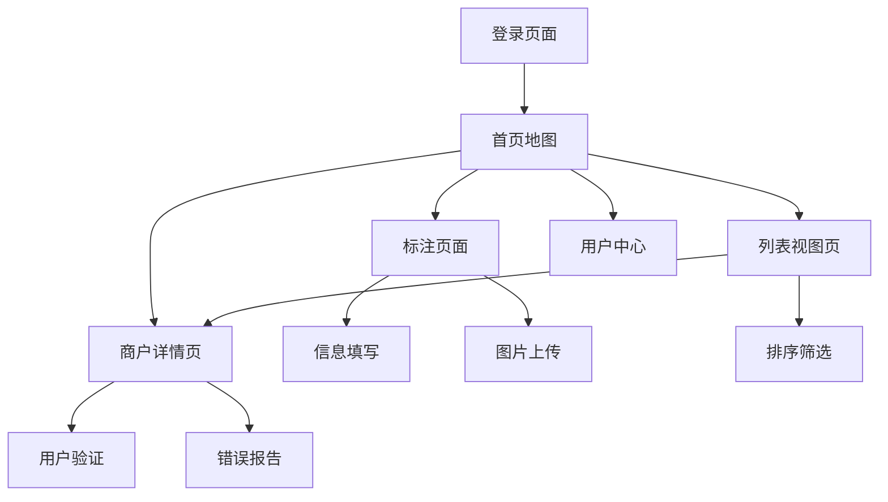

# 玩卡爱好者地图应用 - 产品需求文档

## 1. 产品概述

玩卡爱好者地图是一个专为信用卡和支付爱好者设计的众包地图平台，用户可以标注和查找支持刷卡的商户位置及详细支付信息。
- 解决玩卡用户寻找可刷卡商户的痛点，提供准确的POS机信息和支付方式详情
- 通过众包模式建立全面的商户支付信息数据库，帮助用户优化消费体验

## 2. 核心功能

### 2.1 用户角色

| 角色 | 注册方式 | 核心权限 |
|------|----------|----------|
| 普通用户 | 第三方登录（LinuxDo、GitHub等） | 查看地图、标注商户、验证信息 |
| 认证用户 | 完成身份验证 | 享有普通用户权限，标注权重更高 |
| 管理员 | 系统分配 | 审核标注、管理用户、处理举报 |

### 2.2 功能模块

我们的玩卡地图应用包含以下主要页面：
1. **首页地图**：地图展示、位置获取、商户标记显示、搜索功能
2. **商户详情页**：详细信息展示、用户验证、评价系统、错误报告
3. **标注页面**：位置选择、详细信息填写、图片上传
4. **列表视图页**：商户列表、排序筛选、距离计算
5. **用户中心**：个人信息、标注历史、收藏管理
6. **登录页面**：第三方登录集成

### 2.3 页面详情

| 页面名称 | 模块名称 | 功能描述 |
|----------|----------|----------|
| 首页地图 | 地图展示 | 集成高德地图，显示用户当前位置，展示商户标记点，支持地图缩放拖拽 |
| 首页地图 | 位置服务 | 自动获取用户当前位置，支持手动定位，位置权限管理 |
| 首页地图 | 商户搜索 | 支持商户名称搜索，地址搜索，智能提示功能 |
| 首页地图 | 标记展示 | 类似充电宝小程序的标记样式，不同支付方式用不同图标区分 |
| 商户详情页 | 信息展示 | 显示POS机型号、收单机构、支持的支付方式（外卡、Apple Pay、Google Pay、小额免密等） |
| 商户详情页 | 参考链接 | 显示用户添加的小红书笔记或LinuxDO帖子链接，提供额外参考信息 |
| 商户详情页 | 用户验证 | 其他用户可点击"确认"验证标注真实性，显示验证次数和可信度 |
| 商户详情页 | 评价系统 | 用户可对商户进行评分评价，查看其他用户评价 |
| 商户详情页 | 错误报告 | 用户可报告标注信息错误，提交修改建议 |
| 标注页面 | 位置选择 | 在地图上精确选择商户位置，支持地址搜索定位 |
| 标注页面 | 信息填写 | 填写商户名称、POS机型号、收单机构、支持的支付方式等详细信息 |
| 标注页面 | 图片上传 | 上传POS机照片、商户门头照片作为验证 |
| 标注页面 | 外部链接 | 可选添加相关的小红书笔记链接或LinuxDO帖子链接作为补充参考 |
| 列表视图页 | 商户列表 | 以列表形式展示附近商户，显示距离、评分、支付方式 |
| 列表视图页 | 排序筛选 | 支持按距离、评分、验证次数排序，按支付方式筛选 |
| 用户中心 | 个人信息 | 显示用户基本信息、标注统计、信誉等级 |
| 用户中心 | 标注历史 | 查看用户历史标注记录，编辑或删除标注 |
| 用户中心 | 收藏管理 | 管理收藏的商户，快速导航 |
| 登录页面 | 第三方登录 | 集成LinuxDo、GitHub、Google等第三方登录方式 |

## 3. 核心流程

**用户标注流程：**
用户发现可刷卡商户 → 打开应用并登录 → 自动获取当前位置 → 在地图上搜索或定位商户 → 选择标注 → 填写详细支付信息 → 上传验证图片 → 提交标注

**用户查找流程：**
用户打开应用 → 登录并获取位置 → 查看地图上的商户标记 → 切换到列表视图 → 按需求排序筛选 → 查看商户详情 → 验证或收藏商户

**信息验证流程：**
用户查看商户详情 → 实地验证支付信息 → 点击"确认"按钮 → 增加商户可信度 → 如发现错误可提交报告

## 4. 用户界面设计

### 4.1 设计风格

- **主色调**：蓝色系（#2563EB）为主色，绿色（#10B981）为辅助色表示验证通过
- **按钮样式**：圆角按钮设计，支持触摸反馈
- **字体**：系统默认字体，标题16px，正文14px，辅助信息12px
- **布局风格**：卡片式设计，顶部导航栏，底部标签栏
- **图标风格**：线性图标，支付方式使用品牌色彩图标

### 4.2 页面设计概览

| 页面名称 | 模块名称 | UI元素 |
|----------|----------|--------|
| 首页地图 | 地图展示 | 全屏地图，浮动搜索框，位置按钮，图层切换按钮 |
| 首页地图 | 商户标记 | 不同颜色标记点，支付方式小图标，聚合显示 |
| 商户详情页 | 信息卡片 | 商户名称，地址，支付方式图标组，POS机信息卡片 |
| 商户详情页 | 操作按钮 | 确认按钮（绿色），收藏按钮，导航按钮，报错按钮（红色） |
| 标注页面 | 表单设计 | 分步骤表单，进度指示器，图片上传区域，提交按钮 |
| 列表视图页 | 列表项 | 商户卡片，距离标签，评分星级，支付方式图标 |

### 4.3 响应式设计

产品主要面向移动端用户，采用移动优先的响应式设计，支持触摸操作优化，兼容桌面端浏览器访问。