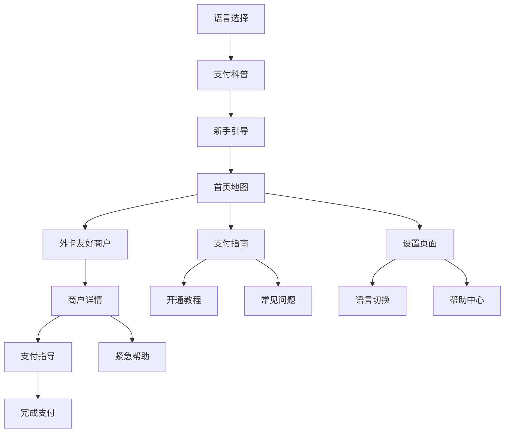

# 外国来华人士支付体验优化 - 产品需求文档

## 1. 产品概述

针对外国来华人士在中国使用移动支付和银行卡支付时遇到的困难和痛点，对现有支付地图应用进行专项优化。
- 解决外国用户对中国支付生态不熟悉、语言障碍、操作复杂等问题
- 提供直观的新手引导和支付方式科普，帮助外国用户快速适应中国的支付环境
- 通过多语言支持和文化本地化设计，提升外国用户的使用体验和支付成功率

## 2. 核心功能

### 2.1 用户角色

| 角色 | 注册方式 | 核心权限 |
|------|----------|----------|
| 外国游客 | 快速注册（邮箱/手机） | 查看地图、使用新手引导、收藏商户 |
| 外国居民 | 完整注册验证 | 享有游客权限，可标注商户、参与验证 |
| 本地向导 | 认证用户升级 | 提供多语言标注、协助外国用户 |
| 管理员 | 系统分配 | 管理多语言内容、处理跨文化问题 |

### 2.2 功能模块

我们的外国用户优化功能包含以下主要模块：
1. **新手引导系统**：支付方式科普、操作指南、常见问题解答
2. **多语言支持增强**：界面翻译、语音导航、文化适配
3. **支付方式详解**：外卡支持说明、移动支付教程、银联介绍
4. **智能推荐系统**：基于用户国籍推荐合适的支付方式和商户
5. **紧急帮助功能**：24小时客服、紧急联系方式、问题反馈
6. **文化适配界面**：符合外国用户习惯的UI设计和交互方式

### 2.3 页面详情

| 页面名称 | 模块名称 | 功能描述 |
|----------|----------|----------|
| 欢迎引导页 | 语言选择 | 首次打开应用时选择语言，支持英语、俄语、德语、中文 |
| 欢迎引导页 | 支付科普 | 介绍中国主要支付方式：支付宝、微信支付、银联、外卡等 |
| 欢迎引导页 | 快速教程 | 3-5步简单教程，展示如何查找和使用支持外卡的商户 |
| 首页地图 | 外卡友好标识 | 特殊图标标识支持外卡的商户，优先显示对外国用户友好的地点 |
| 首页地图 | 智能推荐 | 根据用户位置和偏好，推荐附近支持外卡的热门商户 |
| 首页地图 | 语音导航 | 支持多语言语音播报，帮助用户导航到目标商户 |
| 商户详情页 | 外卡支持详情 | 详细说明支持的外卡类型：Visa、MasterCard、JCB、American Express等 |
| 商户详情页 | 支付流程指导 | 图文并茂展示在该商户的具体支付操作步骤 |
| 商户详情页 | 多语言评价 | 显示其他外国用户的多语言评价和使用体验 |
| 商户详情页 | 紧急帮助 | 一键联系客服、查看常见问题、获取支付帮助 |
| 支付指南页 | 支付方式对比 | 对比不同支付方式的优缺点、适用场景、手续费等 |
| 支付指南页 | 开通教程 | 详细的支付宝、微信支付开通和绑卡教程 |
| 支付指南页 | 安全提示 | 支付安全注意事项、防诈骗提醒、紧急处理方法 |
| 支付指南页 | 常见问题 | FAQ形式的常见支付问题和解决方案 |
| 设置页面 | 语言切换 | 随时切换界面语言，支持实时翻译 |
| 设置页面 | 偏好设置 | 设置偏好的支付方式、货币显示、距离单位等 |
| 设置页面 | 帮助中心 | 在线客服、使用教程、联系方式、意见反馈 |

## 3. 核心流程

**外国用户首次使用流程：**
下载应用 → 选择语言 → 观看支付科普视频 → 完成新手引导 → 设置偏好支付方式 → 查看附近外卡友好商户 → 导航到商户 → 查看支付指导 → 完成支付

**日常使用流程：**
打开应用 → 自动定位 → 查看推荐商户 → 筛选支持外卡的商户 → 查看详细支付信息 → 导航前往 → 按指导完成支付 → 评价体验

**遇到问题流程：**
支付失败 → 查看常见问题 → 联系在线客服 → 获得实时帮助 → 记录问题反馈 → 优化用户体验

## 4. 用户界面设计

### 4.1 设计风格

- **主色调**：国际化蓝色（#1E40AF）为主色，绿色（#059669）表示外卡支持
- **按钮样式**：大尺寸圆角按钮，适合不同文化背景用户的操作习惯
- **字体**：支持多语言字体，英文使用Roboto，中文使用系统字体，字号适当放大
- **布局风格**：简洁明了的卡片式设计，减少认知负担，图标化操作
- **图标风格**：国际通用图标，支付方式使用官方品牌图标，文化中性设计

### 4.2 页面设计概览

| 页面名称 | 模块名称 | UI元素 |
|----------|----------|--------|
| 欢迎引导页 | 语言选择 | 国旗图标，语言名称，大按钮设计，进度指示器 |
| 欢迎引导页 | 支付科普 | 动画演示，图文结合，分步骤展示，跳过选项 |
| 首页地图 | 外卡标识 | 特殊颜色标记，外卡图标，优先级排序显示 |
| 商户详情页 | 支付信息 | 外卡类型图标，支持状态标识，详细说明文字 |
| 支付指南页 | 教程内容 | 步骤化图解，视频教程，交互式演示 |
| 设置页面 | 多语言选项 | 语言列表，实时预览，一键切换功能 |

### 4.3 响应式设计

采用移动优先的国际化设计，支持从右到左的文字排版（阿拉伯语等），兼容不同屏幕尺寸，优化触摸操作体验。

## 5. 特殊需求

### 5.1 多语言支持
- 界面完全翻译为英语、俄语、德语
- 商户信息支持多语言标注
- 语音导航支持多语言播报
- 客服支持多语言沟通

### 5.2 文化适配
- 支付习惯差异说明
- 本地化的操作提示
- 符合外国用户认知的信息架构
- 避免文化敏感内容

### 5.3 技术要求
- 离线地图支持，减少网络依赖
- 快速加载，优化海外网络访问
- 数据同步，支持跨设备使用
- 安全加密，保护用户隐私