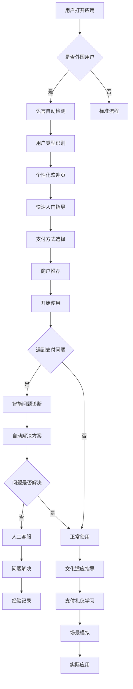

# 外国用户支付体验优化指南

## 1. 产品概述

针对外国来华人士在中国使用移动支付和POS机时遇到的困难，设计的全方位支付体验优化方案。通过深入分析外国用户的痛点，提供个性化的解决方案和指导，帮助他们快速适应中国的支付环境。

- 解决外国用户在中国支付时的语言障碍、操作困难和文化差异问题
- 提供多语言支持和文化适配的支付指导服务
- 建立完善的用户支持体系，提升外国用户的支付成功率和满意度

## 2. 核心功能

### 2.1 用户角色

| 角色 | 注册方式 | 核心权限 |
|------|----------|----------|
| 外国游客 | 快速注册或游客模式 | 可访问基础支付指导，查看附近支持国际卡的商户 |
| 外国居民 | 完整注册验证 | 可保存偏好设置，获得个性化推荐，参与社区讨论 |
| 商务人士 | 企业邮箱验证 | 可访问商务支付指导，获得企业级支持服务 |
| 留学生 | 学校邮箱验证 | 可享受学生优惠信息，获得校园支付指导 |

### 2.2 功能模块

我们的外国用户优化系统包含以下主要页面：
1. **智能欢迎页**：自动检测用户语言和位置，提供个性化欢迎体验
2. **支付方式指导页**：详细介绍各种支付方式的使用方法和适用场景
3. **商户筛选页**：按支付方式筛选商户，优先显示支持国际卡的商户
4. **实时帮助页**：24/7多语言客服支持，常见问题快速解答
5. **文化适配页**：介绍中国支付文化和礼仪，避免文化冲突
6. **紧急支援页**：支付失败时的应急解决方案和联系方式

### 2.3 页面详情

| 页面名称 | 模块名称 | 功能描述 |
|----------|----------|----------|
| 智能欢迎页 | 语言自动检测 | 根据设备语言和IP位置自动选择合适的界面语言 |
| 智能欢迎页 | 个性化推荐 | 基于用户类型和位置推荐最相关的支付方式和商户 |
| 智能欢迎页 | 快速入门 | 提供3分钟快速入门指南，涵盖最基本的支付操作 |
| 支付方式指导页 | 国际卡指导 | 详细说明Visa、MasterCard、AmEx等国际卡的使用方法 |
| 支付方式指导页 | 移动支付教程 | 分步骤指导如何注册和使用支付宝、微信支付 |
| 支付方式指导页 | 现金支付提醒 | 提醒哪些场所仍接受现金，如何准备合适的现金 |
| 商户筛选页 | 支付方式筛选 | 按支持的支付方式筛选商户，标注国际卡接受度 |
| 商户筛选页 | 距离优化 | 优先显示距离用户最近且支持其偏好支付方式的商户 |
| 商户筛选页 | 实时状态 | 显示商户的营业状态和支付设备可用性 |
| 实时帮助页 | 多语言客服 | 提供英语、俄语、德语的实时聊天和语音支持 |
| 实时帮助页 | 智能问答 | AI驱动的常见问题自动回答系统 |
| 实时帮助页 | 视频通话 | 紧急情况下的视频客服支持，可进行屏幕共享 |
| 文化适配页 | 支付礼仪 | 介绍中国支付时的文化习俗和注意事项 |
| 文化适配页 | 常用短语 | 提供支付相关的中文常用短语和发音指导 |
| 文化适配页 | 场景模拟 | 模拟餐厅、商店、交通等场景的支付流程 |
| 紧急支援页 | 故障排除 | 支付失败时的自动诊断和解决方案推荐 |
| 紧急支援页 | 应急联系 | 提供银行客服、应用客服等紧急联系方式 |
| 紧急支援页 | 备用方案 | 推荐附近的ATM、银行网点和现金支付商户 |

## 3. 核心流程

### 新用户首次使用流程
用户打开应用 → 自动语言检测 → 用户类型识别 → 个性化欢迎 → 快速入门指导 → 支付方式选择 → 商户推荐 → 开始使用

### 支付困难解决流程
用户遇到支付问题 → 智能问题诊断 → 自动解决方案推荐 → 人工客服介入 → 问题解决 → 经验记录和分享

### 文化适应流程
用户选择文化指导 → 支付礼仪介绍 → 常用短语学习 → 场景模拟练习 → 实际应用 → 反馈和改进

## 4. 用户界面设计

### 4.1 设计风格

- **主色调**：国际化蓝色 (#1E40AF)，传达专业和信任感
- **辅助色**：温暖橙色 (#F97316 引导色)，友好绿色 (#059669 成功色)，警示红色 (#DC2626)
- **按钮样式**：大尺寸圆角按钮，适合不同文化背景用户的操作习惯
- **字体**：多语言优化字体，确保各种语言的清晰显示
- **字体大小**：比标准应用稍大，标题 28px，正文 18px，便于阅读
- **布局风格**：简洁明了的卡片式设计，减少认知负担
- **图标风格**：国际通用图标，避免文化误解，配合文字说明
- **色彩对比**：高对比度设计，确保在各种光线条件下的可读性

### 4.2 页面设计概览

| 页面名称 | 模块名称 | UI元素 |
|----------|----------|--------|
| 智能欢迎页 | 语言检测器 | 自动检测提示，手动切换选项，国旗图标，语言名称本地化显示 |
| 智能欢迎页 | 个性化推荐 | 用户类型卡片，推荐理由说明，一键应用按钮 |
| 支付方式指导页 | 国际卡指导 | 信用卡品牌Logo，分步骤操作图解，注意事项高亮显示 |
| 支付方式指导页 | 移动支付教程 | 应用图标，二维码示例，操作截图，视频教程链接 |
| 商户筛选页 | 支付筛选器 | 支付方式图标按钮，筛选状态指示，清除筛选选项 |
| 商户筛选页 | 商户列表 | 商户卡片，支付方式标签，距离显示，营业状态指示 |
| 实时帮助页 | 客服聊天 | 聊天气泡，语言选择，语音输入按钮，文件上传 |
| 实时帮助页 | 问答系统 | 问题分类，搜索框，快速回复按钮，满意度评价 |
| 文化适配页 | 礼仪指导 | 插图说明，文字描述，音频发音，互动测试 |
| 紧急支援页 | 故障诊断 | 问题选择列表，诊断进度条，解决方案卡片，联系按钮 |

### 4.3 响应式设计

- **移动优先**：专为手机使用优化，考虑单手操作便利性
- **触摸友好**：按钮最小尺寸 48px，间距充足，避免误触
- **横屏适配**：支持横屏使用，特别是观看教程视频时
- **字体缩放**：支持系统字体大小设置，适应不同视力需求
- **网络优化**：在弱网环境下仍能正常使用核心功能

## 5. 特殊需求

### 5.1 多语言深度优化

- **语言检测**：智能检测用户的首选语言和地区设置
- **内容本地化**：不仅翻译文字，还要适配当地的表达习惯
- **文化适配**：考虑不同文化背景下的颜色、图标、布局偏好
- **语音支持**：提供多语言语音指导和客服支持
- **实时翻译**：集成翻译功能，帮助用户理解中文界面

### 5.2 支付方式优化

- **国际卡优先**：优先显示支持国际信用卡的商户和POS机
- **汇率显示**：实时显示人民币与用户本国货币的汇率
- **手续费提醒**：明确显示可能产生的手续费和汇率损失
- **支付限额**：提醒用户各种支付方式的限额和限制
- **安全提示**：提供支付安全建议和防诈骗指导

### 5.3 用户支持优化

- **24/7客服**：提供全天候多语言客服支持
- **本地化客服**：了解当地法规和习俗的客服团队
- **紧急联系**：提供紧急情况下的快速联系方式
- **社区支持**：建立外国用户互助社区
- **反馈机制**：收集用户反馈，持续改进服务

## 6. 技术实现

### 6.1 智能检测系统

- **语言检测**：基于浏览器语言、IP地址、用户行为的智能语言检测
- **用户画像**：通过机器学习分析用户类型和需求
- **个性化推荐**：基于用户画像和位置信息的智能推荐算法

### 6.2 实时支持系统

- **多语言客服**：集成多语言实时聊天和视频通话功能
- **智能问答**：基于NLP的智能问答系统，支持多语言查询
- **问题诊断**：自动诊断支付问题并提供解决方案

### 6.3 数据分析系统

- **用户行为分析**：跟踪用户使用路径，识别痛点和改进机会
- **支付成功率监控**：监控不同用户群体的支付成功率
- **反馈分析**：分析用户反馈，优先处理高频问题

## 7. 用户体验优化策略

### 7.1 降低学习成本

- **渐进式引导**：分步骤引导，避免信息过载
- **视觉化教程**：使用图片、视频、动画等多媒体内容
- **实践机会**：提供安全的模拟环境让用户练习

### 7.2 提高成功率

- **预防性提示**：在用户可能遇到问题前提供预防性指导
- **智能推荐**：推荐最适合用户的支付方式和商户
- **备用方案**：为每种支付方式提供备用解决方案

### 7.3 建立信任

- **透明信息**：清楚显示费用、汇率、安全措施等信息
- **用户评价**：展示其他外国用户的真实评价和经验
- **官方认证**：显示官方认证和安全保障信息

### 7.4 持续改进

- **A/B测试**：持续测试不同的界面和流程设计
- **用户反馈**：建立完善的用户反馈收集和处理机制
- **数据驱动**：基于用户行为数据持续优化产品功能