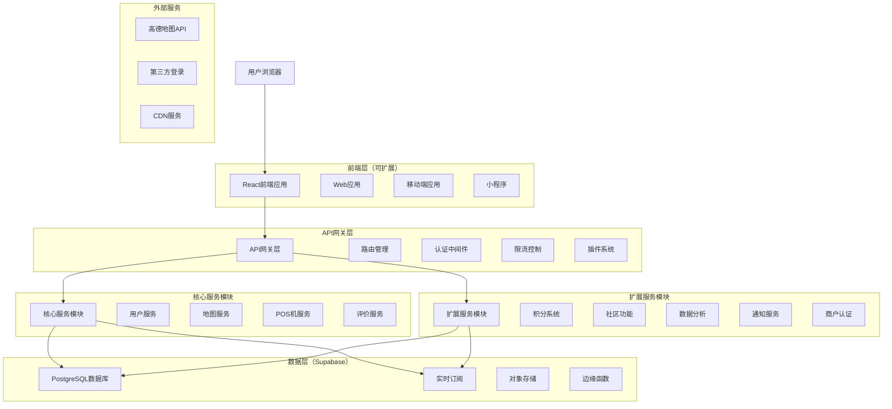
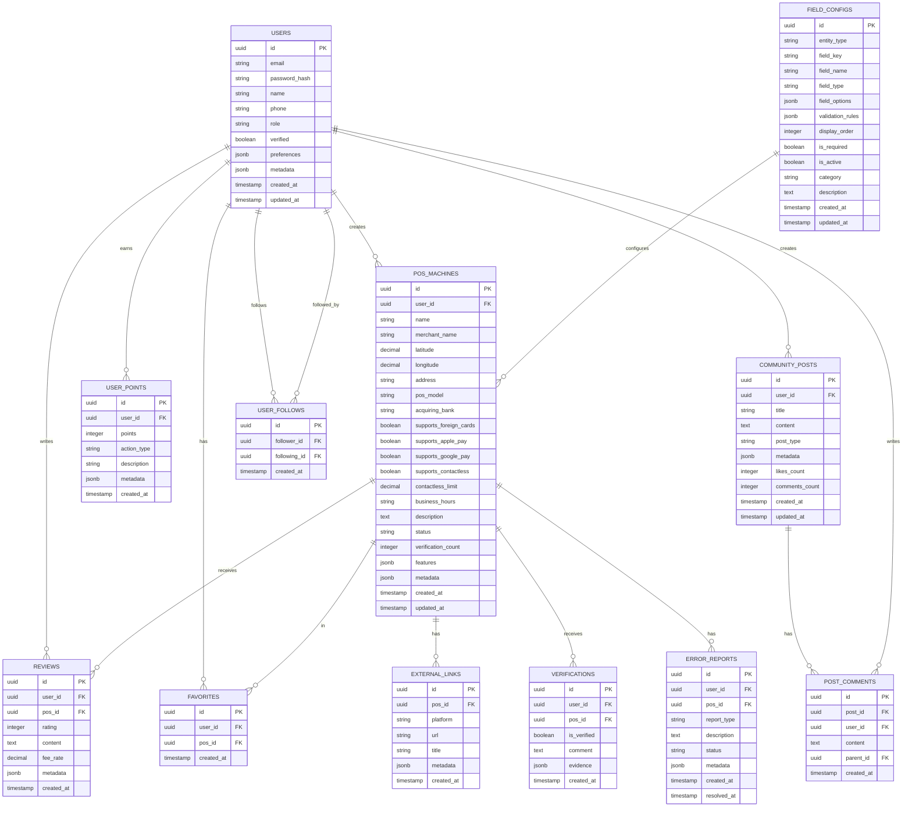

# 玩卡爱好者地图应用 - 技术架构文档

## 1. 可扩展架构设计

### 1.1 整体架构（模块化设计）



### 1.2 微服务架构原则

- **服务独立性**：每个功能模块独立部署和扩展
- **API优先**：所有服务通过标准化API通信
- **插件化设计**：支持第三方插件和扩展
- **事件驱动**：使用事件总线实现服务间解耦
- **配置外部化**：所有配置可动态调整

## 2. 低成本可扩展技术栈

### 2.1 核心技术选型（免费/低成本优先）

**前端技术栈**
* React@18 + TypeScript + Tailwind CSS + Vite
* React Router（路由管理）
* Zustand（轻量级状态管理）
* React Query（数据获取和缓存）
* PWA支持（离线功能）

**后端服务（Serverless优先）**
* Supabase（免费额度：500MB数据库 + 1GB存储 + 50MB文件上传）
* Vercel Edge Functions（免费额度：100GB-hours/月）
* Cloudflare Workers（免费额度：100,000请求/天）

**数据库设计**
* PostgreSQL（Supabase提供）
* 支持JSON字段存储扩展数据
* 分表策略支持大数据量
* 读写分离和缓存策略

**第三方服务**
* 高德地图API（免费额度：10万次/天）
* Supabase Auth（支持多种OAuth）
* Cloudflare CDN（免费）
* GitHub Actions（CI/CD，免费）

### 2.2 扩展性设计原则

**模块化架构**
* 每个功能模块独立npm包
* 支持动态加载和懒加载
* 插件系统架构

**API设计**
* RESTful API + GraphQL（可选）
* 版本控制（v1, v2...）
* 标准化错误处理
* 自动生成API文档

**数据库扩展性**
* 软删除策略
* 审计日志表
* 配置表支持功能开关
* 元数据表支持动态字段

## 3. 潜在需求分析与扩展规划

### 3.1 短期扩展需求（3-6个月）

**用户体验优化**
* 积分奖励系统：标注、验证获得积分
* 用户等级制度：新手、达人、专家等级
* 消息通知系统：新评价、验证结果通知
* 离线地图缓存：支持无网络查看

**数据质量提升**
* 商户认证系统：官方认证标识
* 众包审核机制：用户互相审核标注
* 数据质量评分：基于验证次数和用户信誉
* 重复标注检测：防止重复提交

### 3.2 中期扩展需求（6-12个月）

**社区功能**
* 用户关注系统：关注活跃标注者
* 讨论区功能：商户相关讨论
* 标注分享：分享到社交媒体
* 用户排行榜：贡献度排名

**商业化功能**
* 商户入驻系统：商户自主管理信息
* 广告位系统：精准投放相关广告
* 会员订阅：高级功能付费使用
* API开放平台：第三方应用接入

### 3.3 长期扩展需求（1年以上）

**智能化功能**
* AI推荐系统：个性化商户推荐
* 图像识别：自动识别POS机型号
* 数据分析平台：用户行为分析
* 预测分析：商户热度预测

**国际化扩展**
* 多语言支持：中英文等多语言
* 多地图服务：Google Maps等
* 多货币支持：不同国家货币
* 本地化适配：不同地区支付习惯

## 4. 可扩展路由设计

### 4.1 核心路由

| 路由        | 用途                  | 扩展性 |
| --------- | ------------------- | ------ |
| /         | 首页地图，显示商户位置标记和搜索功能 | 支持多种地图视图 |
| /merchant/:id  | 商户详情页，显示POS机信息、用户验证和评价 | 支持插件扩展 |
| /add      | 标注页面，用户添加新的商户位置   | 支持自定义字段 |
| /list     | 列表视图页，显示商户列表和排序筛选 | 支持多种排序算法 |
| /profile  | 用户中心，个人信息和标注历史      | 支持个性化配置 |
| /login    | 登录页面，第三方登录入口         | 支持多种登录方式 |
| /report/:id | 错误报告页面，提交标注信息修改 | 支持工作流扩展 |

### 4.2 扩展路由（预留）

| 路由        | 用途                  | 实现阶段 |
| --------- | ------------------- | -------- |
| /community | 社区讨论页面 | 中期 |
| /points   | 积分系统页面 | 短期 |
| /admin    | 管理后台 | 短期 |
| /api/docs | API文档页面 | 中期 |
| /analytics | 数据分析页面 | 长期 |
| /business | 商户入驻页面 | 中期 |

## 5. 可扩展API设计

### 5.1 API设计原则

**版本控制策略**
* URL版本控制：`/api/v1/`, `/api/v2/`
* 向后兼容：旧版本API保持可用
* 渐进式升级：新功能优先在新版本实现

**标准化响应格式**
```json
{
  "success": true,
  "data": {},
  "message": "操作成功",
  "code": 200,
  "timestamp": "2024-01-01T00:00:00Z",
  "version": "v1"
}
```

**错误处理标准**
```json
{
  "success": false,
  "error": {
    "code": "VALIDATION_ERROR",
    "message": "参数验证失败",
    "details": []
  },
  "timestamp": "2024-01-01T00:00:00Z"
}
```

### 5.2 核心API接口

**动态字段配置API**

```
GET /api/v1/field-configs
```

请求参数：

| 参数名称 | 参数类型 | 是否必需 | 描述 |
| ------ | ------ | ----- | ---- |
| entity_type | string | false | 实体类型筛选 |
| is_active | boolean | false | 是否启用筛选 |
| category | string | false | 分类筛选 |

响应数据：

```json
{
  "success": true,
  "data": {
    "configs": [
      {
        "id": "uuid",
        "entityType": "pos_machine",
        "fieldKey": "pos_model",
        "fieldName": "POS机型号",
        "fieldType": "text",
        "fieldOptions": {
          "maxLength": 100,
          "placeholder": "请输入POS机型号"
        },
        "validationRules": {
          "required": true,
          "maxLength": 100
        },
        "displayOrder": 1,
        "isRequired": true,
        "isActive": true,
        "category": "基础信息",
        "description": "POS机的具体型号信息"
      }
    ]
  }
}
```

```
POST /api/v1/admin/field-configs
```

请求参数：

| 参数名称 | 参数类型 | 是否必需 | 描述 |
| ------ | ------ | ----- | ---- |
| entityType | string | true | 实体类型 |
| fieldKey | string | true | 字段标识符 |
| fieldName | string | true | 字段显示名称 |
| fieldType | string | true | 字段类型 |
| fieldOptions | object | false | 字段选项配置 |
| validationRules | object | false | 验证规则 |
| displayOrder | number | false | 显示顺序 |
| isRequired | boolean | false | 是否必填 |
| category | string | false | 字段分类 |
| description | string | false | 字段描述 |

**POS机管理API（支持动态字段）**

```
GET /api/v1/merchants
```

请求参数：

| 参数名称   | 参数类型   | 是否必需  | 描述       |
| ------ | ------ | ----- | -------- |
| lat    | number | false | 纬度坐标     |
| lng    | number | false | 经度坐标     |
| radius | number | false | 搜索半径（公里） |
| type   | string | false | POS机类型筛选 |
| page   | number | false | 页码（默认1） |
| limit  | number | false | 每页数量（默认20） |
| sort   | string | false | 排序方式 |
| filters | object | false | 扩展筛选条件 |

响应数据：

```json
{
  "success": true,
  "data": {
    "merchants": [
      {
        "id": "uuid",
        "name": "星巴克咖啡",
        "latitude": 39.9042,
        "longitude": 116.4074,
        "address": "北京市朝阳区国贸商城",
        "pos_info": {
          "model": "Ingenico iWL250",
          "acquiring_bank": "招商银行",
          "supports_foreign_cards": true,
          "supports_apple_pay": true,
          "supports_google_pay": true,
          "contactless_limit": 1000.00
        },
        "extended_info": {
          "supports_samsung_pay": true,
          "supports_qr_code": true,
          "supports_nfc": true,
          "transaction_fee_rate": 0.6,
          "daily_limit": 50000,
          "single_limit": 5000,
          "supported_cards": ["Visa", "Mastercard", "银联"],
          "business_type": "餐饮",
          "wifi_required": false,
          "power_source": "插电"
        },
        "verification_count": 5,
        "rating": 4.5,
        "created_at": "2024-01-01T00:00:00Z",
        "updated_at": "2024-01-01T00:00:00Z"
      }
    ],
    "pagination": {
      "page": 1,
      "limit": 20,
      "total": 100,
      "pages": 5
    }
  }
}
```

**用户认证API（支持多种登录方式）**

```
POST /api/v1/auth/oauth
```

请求参数：

| 参数名称     | 参数类型   | 是否必需 | 描述   |
| -------- | ------ | ---- | ---- |
| provider | string | true | 登录提供商（github, google, linuxdo） |
| code     | string | true | 授权码 |
| redirect_uri | string | true | 回调地址 |

```
PUT /api/v1/admin/field-configs/{id}
```

更新字段配置，参数同创建接口。

```
DELETE /api/v1/admin/field-configs/{id}
```

删除字段配置。

```
POST /api/v1/merchants
```

创建POS机信息（支持动态字段）：

请求参数：

| 参数名称 | 参数类型 | 是否必需 | 描述 |
| ------ | ------ | ----- | ---- |
| name | string | true | 商户名称 |
| latitude | number | true | 纬度 |
| longitude | number | true | 经度 |
| address | string | true | 地址 |
| basic_info | object | true | 基础信息 |
| extended_info | object | false | 扩展信息（动态字段） |
| external_links | array | false | 外部链接 |

示例请求：

```json
{
  "name": "星巴克咖啡",
  "merchant_name": "星巴克咖啡（国贸店）",
  "latitude": 39.9042,
  "longitude": 116.4074,
  "address": "北京市朝阳区国贸商城",
  "basic_info": {
    "pos_model": "Ingenico iWL250",
    "acquiring_bank": "招商银行",
    "supports_foreign_cards": true,
    "supports_apple_pay": true,
    "supports_google_pay": true,
    "contactless_limit": 1000.00
  },
  "extended_info": {
    "supports_samsung_pay": true,
    "supports_qr_code": true,
    "transaction_fee_rate": 0.6,
    "business_type": "餐饮",
    "supported_cards": ["Visa", "Mastercard", "银联"]
  },
  "external_links": [
    {
      "platform": "linuxdo",
      "url": "https://linux.do/t/topic/12345",
      "title": "星巴克POS机使用体验",
      "description": "详细的使用体验分享"
    }
  ]
}
```

### 5.3 动态字段扩展优势

**灵活性优势**
* **无需代码修改**：新增字段无需修改前端代码
* **即时生效**：管理员配置后立即在表单中显示
* **类型安全**：支持多种数据类型和验证规则
* **分类管理**：字段按分类组织，界面清晰

**可维护性优势**
* **配置驱动**：表单结构完全由配置决定
* **版本兼容**：新字段不影响现有数据
* **权限控制**：只有管理员可以修改字段配置
* **审计追踪**：所有配置变更都有记录

**扩展性优势**
* **多实体支持**：不仅支持POS机，还可扩展到其他实体
* **插件化架构**：支持第三方字段类型扩展
* **国际化支持**：字段名称支持多语言
* **移动端适配**：动态表单自动适配移动设备

### 5.4 扩展API接口（预留）

**积分系统API**
```
GET /api/v1/users/{id}/points
POST /api/v1/points/earn
POST /api/v1/points/redeem
```

**社区功能API**
```
GET /api/v1/community/posts
POST /api/v1/community/posts
GET /api/v1/users/{id}/followers
```

**数据分析API**
```
GET /api/v1/analytics/merchants/popular
GET /api/v1/analytics/users/activity
GET /api/v1/analytics/trends
```

## 6. 动态字段扩展设计

### 6.1 POS机信息动态扩展架构

为了支持未来可能添加的更多POS机信息字段，我们采用以下扩展性设计：

**设计原则**
* **JSONB字段存储**：使用PostgreSQL的JSONB字段存储可扩展属性
* **配置驱动表单**：前端表单根据配置动态渲染
* **版本兼容性**：新字段不影响现有数据
* **类型安全**：支持多种数据类型验证
* **管理界面**：管理员可动态添加新字段

**动态字段配置表设计**

```sql
-- 字段配置表
CREATE TABLE field_configs (
    id UUID PRIMARY KEY DEFAULT gen_random_uuid(),
    entity_type VARCHAR(50) NOT NULL, -- 'pos_machine', 'review', etc.
    field_key VARCHAR(100) NOT NULL,   -- 字段标识符
    field_name VARCHAR(200) NOT NULL,  -- 显示名称
    field_type VARCHAR(50) NOT NULL,   -- 'text', 'number', 'boolean', 'select', 'multiselect'
    field_options JSONB DEFAULT '{}', -- 选项配置（下拉框等）
    validation_rules JSONB DEFAULT '{}', -- 验证规则
    display_order INTEGER DEFAULT 0,
    is_required BOOLEAN DEFAULT false,
    is_active BOOLEAN DEFAULT true,
    category VARCHAR(100),             -- 字段分类
    description TEXT,                  -- 字段说明
    created_at TIMESTAMP WITH TIME ZONE DEFAULT NOW(),
    updated_at TIMESTAMP WITH TIME ZONE DEFAULT NOW(),
    UNIQUE(entity_type, field_key)
);

-- 创建索引
CREATE INDEX idx_field_configs_entity ON field_configs(entity_type);
CREATE INDEX idx_field_configs_active ON field_configs(is_active);
CREATE INDEX idx_field_configs_order ON field_configs(display_order);
```

**POS机扩展信息存储**

```sql
-- 在pos_machines表中添加扩展字段
ALTER TABLE pos_machines ADD COLUMN IF NOT EXISTS extended_info JSONB DEFAULT '{}';

-- 为扩展信息创建GIN索引
CREATE INDEX idx_pos_machines_extended_info ON pos_machines USING GIN(extended_info);
```

**字段配置示例数据**

```sql
-- 插入基础字段配置
INSERT INTO field_configs (entity_type, field_key, field_name, field_type, validation_rules, display_order, is_required, category) VALUES
-- 基础信息
('pos_machine', 'pos_model', 'POS机型号', 'text', '{"maxLength": 100}', 1, true, '基础信息'),
('pos_machine', 'acquiring_bank', '收单机构', 'select', '{"options": ["招商银行", "工商银行", "建设银行", "农业银行", "中国银行", "交通银行", "其他"]}', 2, true, '基础信息'),

-- 支付功能
('pos_machine', 'supports_foreign_cards', '支持外卡', 'boolean', '{}', 10, false, '支付功能'),
('pos_machine', 'supports_apple_pay', '支持Apple Pay', 'boolean', '{}', 11, false, '支付功能'),
('pos_machine', 'supports_google_pay', '支持Google Pay', 'boolean', '{}', 12, false, '支付功能'),
('pos_machine', 'supports_samsung_pay', '支持Samsung Pay', 'boolean', '{}', 13, false, '支付功能'),
('pos_machine', 'contactless_limit', '小额免密限额', 'number', '{"min": 0, "max": 10000, "step": 100}', 14, false, '支付功能'),

-- 扩展功能（预留）
('pos_machine', 'supports_qr_code', '支持二维码支付', 'boolean', '{}', 20, false, '扩展功能'),
('pos_machine', 'supports_nfc', '支持NFC支付', 'boolean', '{}', 21, false, '扩展功能'),
('pos_machine', 'transaction_fee_rate', '手续费率', 'number', '{"min": 0, "max": 5, "step": 0.01, "suffix": "%"}', 22, false, '费用信息'),
('pos_machine', 'daily_limit', '单日限额', 'number', '{"min": 0, "max": 1000000, "step": 1000}', 23, false, '限额信息'),
('pos_machine', 'single_limit', '单笔限额', 'number', '{"min": 0, "max": 100000, "step": 100}', 24, false, '限额信息'),
('pos_machine', 'supported_cards', '支持卡种', 'multiselect', '{"options": ["Visa", "Mastercard", "银联", "JCB", "American Express", "Discover"]}', 25, false, '卡种支持'),
('pos_machine', 'business_type', '商户类型', 'select', '{"options": ["餐饮", "零售", "服务", "娱乐", "交通", "医疗", "教育", "其他"]}', 26, false, '商户信息'),
('pos_machine', 'wifi_required', '需要WiFi', 'boolean', '{}', 30, false, '技术要求'),
('pos_machine', 'power_source', '电源类型', 'select', '{"options": ["插电", "电池", "移动电源", "太阳能"]}', 31, false, '技术要求');
```

### 6.2 前端动态表单系统

**React组件设计**

```typescript
// 字段配置类型定义
interface FieldConfig {
  id: string;
  fieldKey: string;
  fieldName: string;
  fieldType: 'text' | 'number' | 'boolean' | 'select' | 'multiselect' | 'textarea';
  fieldOptions: {
    options?: string[];
    min?: number;
    max?: number;
    step?: number;
    maxLength?: number;
    placeholder?: string;
    suffix?: string;
  };
  validationRules: {
    required?: boolean;
    min?: number;
    max?: number;
    pattern?: string;
    custom?: string;
  };
  displayOrder: number;
  isRequired: boolean;
  category: string;
  description?: string;
}

// 动态表单组件
interface DynamicFormProps {
  entityType: string;
  initialData?: Record<string, any>;
  onSubmit: (data: Record<string, any>) => void;
  onFieldChange?: (fieldKey: string, value: any) => void;
}

const DynamicForm: React.FC<DynamicFormProps> = ({
  entityType,
  initialData = {},
  onSubmit,
  onFieldChange
}) => {
  const [fieldConfigs, setFieldConfigs] = useState<FieldConfig[]>([]);
  const [formData, setFormData] = useState(initialData);
  const [errors, setErrors] = useState<Record<string, string>>({});

  // 获取字段配置
  useEffect(() => {
    fetchFieldConfigs(entityType).then(setFieldConfigs);
  }, [entityType]);

  // 按分类分组字段
  const groupedFields = useMemo(() => {
    return fieldConfigs.reduce((groups, field) => {
      const category = field.category || '其他';
      if (!groups[category]) groups[category] = [];
      groups[category].push(field);
      return groups;
    }, {} as Record<string, FieldConfig[]>);
  }, [fieldConfigs]);

  // 渲染字段组件
  const renderField = (config: FieldConfig) => {
    const { fieldKey, fieldType, fieldOptions, isRequired } = config;
    const value = formData[fieldKey];

    switch (fieldType) {
      case 'text':
      case 'textarea':
        return (
          <Input
            type={fieldType === 'textarea' ? 'textarea' : 'text'}
            value={value || ''}
            placeholder={fieldOptions.placeholder}
            maxLength={fieldOptions.maxLength}
            required={isRequired}
            onChange={(e) => handleFieldChange(fieldKey, e.target.value)}
          />
        );
      
      case 'number':
        return (
          <Input
            type="number"
            value={value || ''}
            min={fieldOptions.min}
            max={fieldOptions.max}
            step={fieldOptions.step}
            required={isRequired}
            onChange={(e) => handleFieldChange(fieldKey, parseFloat(e.target.value))}
          />
        );
      
      case 'boolean':
        return (
          <Switch
            checked={value || false}
            onChange={(checked) => handleFieldChange(fieldKey, checked)}
          />
        );
      
      case 'select':
        return (
          <Select
            value={value}
            options={fieldOptions.options?.map(opt => ({ label: opt, value: opt }))}
            required={isRequired}
            onChange={(val) => handleFieldChange(fieldKey, val)}
          />
        );
      
      case 'multiselect':
        return (
          <MultiSelect
            value={value || []}
            options={fieldOptions.options?.map(opt => ({ label: opt, value: opt }))}
            onChange={(val) => handleFieldChange(fieldKey, val)}
          />
        );
      
      default:
        return null;
    }
  };

  return (
    <form onSubmit={handleSubmit}>
      {Object.entries(groupedFields).map(([category, fields]) => (
        <div key={category} className="mb-6">
          <h3 className="text-lg font-semibold mb-3">{category}</h3>
          <div className="grid grid-cols-1 md:grid-cols-2 gap-4">
            {fields
              .sort((a, b) => a.displayOrder - b.displayOrder)
              .map((config) => (
                <div key={config.fieldKey} className="space-y-2">
                  <label className="block text-sm font-medium">
                    {config.fieldName}
                    {config.isRequired && <span className="text-red-500 ml-1">*</span>}
                  </label>
                  {renderField(config)}
                  {config.description && (
                    <p className="text-xs text-gray-500">{config.description}</p>
                  )}
                  {errors[config.fieldKey] && (
                    <p className="text-xs text-red-500">{errors[config.fieldKey]}</p>
                  )}
                </div>
              ))
            }
          </div>
        </div>
      ))}
      
      <div className="flex justify-end space-x-4 mt-6">
        <Button type="button" variant="outline" onClick={onCancel}>
          取消
        </Button>
        <Button type="submit" variant="primary">
          保存
        </Button>
      </div>
    </form>
  );
};
```

### 6.3 管理员字段配置界面

**字段管理组件**

```typescript
// 字段配置管理界面
const FieldConfigManager: React.FC = () => {
  const [configs, setConfigs] = useState<FieldConfig[]>([]);
  const [editingConfig, setEditingConfig] = useState<FieldConfig | null>(null);
  const [showAddModal, setShowAddModal] = useState(false);

  // 添加新字段
  const handleAddField = async (newConfig: Partial<FieldConfig>) => {
    const response = await api.post('/api/v1/admin/field-configs', newConfig);
    setConfigs([...configs, response.data]);
    setShowAddModal(false);
  };

  // 更新字段配置
  const handleUpdateField = async (id: string, updates: Partial<FieldConfig>) => {
    const response = await api.put(`/api/v1/admin/field-configs/${id}`, updates);
    setConfigs(configs.map(c => c.id === id ? response.data : c));
    setEditingConfig(null);
  };

  // 删除字段
  const handleDeleteField = async (id: string) => {
    await api.delete(`/api/v1/admin/field-configs/${id}`);
    setConfigs(configs.filter(c => c.id !== id));
  };

  return (
    <div className="space-y-6">
      <div className="flex justify-between items-center">
        <h2 className="text-2xl font-bold">字段配置管理</h2>
        <Button onClick={() => setShowAddModal(true)}>
          添加新字段
        </Button>
      </div>

      {/* 字段列表 */}
      <div className="bg-white rounded-lg shadow">
        <table className="w-full">
          <thead className="bg-gray-50">
            <tr>
              <th className="px-6 py-3 text-left">字段名称</th>
              <th className="px-6 py-3 text-left">字段类型</th>
              <th className="px-6 py-3 text-left">分类</th>
              <th className="px-6 py-3 text-left">必填</th>
              <th className="px-6 py-3 text-left">状态</th>
              <th className="px-6 py-3 text-left">操作</th>
            </tr>
          </thead>
          <tbody>
            {configs.map((config) => (
              <tr key={config.id} className="border-t">
                <td className="px-6 py-4">{config.fieldName}</td>
                <td className="px-6 py-4">{config.fieldType}</td>
                <td className="px-6 py-4">{config.category}</td>
                <td className="px-6 py-4">
                  {config.isRequired ? '是' : '否'}
                </td>
                <td className="px-6 py-4">
                  <span className={`px-2 py-1 rounded text-xs ${
                    config.isActive ? 'bg-green-100 text-green-800' : 'bg-gray-100 text-gray-800'
                  }`}>
                    {config.isActive ? '启用' : '禁用'}
                  </span>
                </td>
                <td className="px-6 py-4 space-x-2">
                  <Button
                    size="sm"
                    variant="outline"
                    onClick={() => setEditingConfig(config)}
                  >
                    编辑
                  </Button>
                  <Button
                    size="sm"
                    variant="danger"
                    onClick={() => handleDeleteField(config.id)}
                  >
                    删除
                  </Button>
                </td>
              </tr>
            ))}
          </tbody>
        </table>
      </div>
    </div>
  );
};
```

## 7. 可扩展数据模型设计

### 7.1 核心数据模型（支持扩展）



### 6.2 可扩展数据库设计语言

**核心业务表**

**用户表 (users) - 支持扩展字段**

```sql
-- 创建用户表（支持扩展）
CREATE TABLE users (
    id UUID PRIMARY KEY DEFAULT gen_random_uuid(),
    email VARCHAR(255) UNIQUE NOT NULL,
    password_hash VARCHAR(255),
    name VARCHAR(100) NOT NULL,
    phone VARCHAR(20),
    role VARCHAR(20) DEFAULT 'user' CHECK (role IN ('user', 'verified', 'admin')),
    verified BOOLEAN DEFAULT false,
    preferences JSONB DEFAULT '{}',  -- 用户偏好设置
    metadata JSONB DEFAULT '{}',     -- 扩展元数据
    created_at TIMESTAMP WITH TIME ZONE DEFAULT NOW(),
    updated_at TIMESTAMP WITH TIME ZONE DEFAULT NOW()
);

-- 创建索引
CREATE INDEX idx_users_email ON users(email);
CREATE INDEX idx_users_role ON users(role);
CREATE INDEX idx_users_preferences ON users USING GIN(preferences);
CREATE INDEX idx_users_metadata ON users USING GIN(metadata);

-- 设置权限
GRANT SELECT ON users TO anon;
GRANT ALL PRIVILEGES ON users TO authenticated;
```

**POS机表 (pos\_machines) - 灵活字段设计**

```sql
-- 创建POS机表（灵活设计）
CREATE TABLE pos_machines (
    id UUID PRIMARY KEY DEFAULT gen_random_uuid(),
    user_id UUID REFERENCES users(id),
    name VARCHAR(200) NOT NULL,
    merchant_name VARCHAR(200) NOT NULL,
    latitude DECIMAL(10, 8) NOT NULL,
    longitude DECIMAL(11, 8) NOT NULL,
    address TEXT NOT NULL,
    pos_model VARCHAR(100),
    acquiring_bank VARCHAR(100),
    supports_foreign_cards BOOLEAN DEFAULT false,
    supports_apple_pay BOOLEAN DEFAULT false,
    supports_google_pay BOOLEAN DEFAULT false,
    supports_contactless BOOLEAN DEFAULT false,
    contactless_limit DECIMAL(10, 2),
    business_hours VARCHAR(100),
    description TEXT,
    status VARCHAR(20) DEFAULT 'pending' CHECK (status IN ('pending', 'approved', 'rejected')),
    verification_count INTEGER DEFAULT 0,
    features JSONB DEFAULT '{}',     -- 支持功能特性
    metadata JSONB DEFAULT '{}',     -- 扩展元数据
    created_at TIMESTAMP WITH TIME ZONE DEFAULT NOW(),
    updated_at TIMESTAMP WITH TIME ZONE DEFAULT NOW()
);

-- 创建索引
CREATE INDEX idx_pos_machines_location ON pos_machines(latitude, longitude);
CREATE INDEX idx_pos_machines_user_id ON pos_machines(user_id);
CREATE INDEX idx_pos_machines_status ON pos_machines(status);
CREATE INDEX idx_pos_machines_verification ON pos_machines(verification_count DESC);
CREATE INDEX idx_pos_machines_payment_methods ON pos_machines(supports_apple_pay, supports_google_pay, supports_contactless);
CREATE INDEX idx_pos_machines_features ON pos_machines USING GIN(features);
CREATE INDEX idx_pos_machines_metadata ON pos_machines USING GIN(metadata);

-- 设置权限
GRANT SELECT ON pos_machines TO anon;
GRANT ALL PRIVILEGES ON pos_machines TO authenticated;
```

**评价表 (reviews) - 支持扩展验证**

```sql
-- 创建评价表
CREATE TABLE reviews (
    id UUID PRIMARY KEY DEFAULT gen_random_uuid(),
    user_id UUID REFERENCES users(id),
    pos_id UUID REFERENCES pos_machines(id),
    rating INTEGER CHECK (rating >= 1 AND rating <= 5),
    content TEXT,
    fee_rate DECIMAL(5, 4),
    metadata JSONB DEFAULT '{}',     -- 扩展元数据
    created_at TIMESTAMP WITH TIME ZONE DEFAULT NOW()
);

-- 创建索引
CREATE INDEX idx_reviews_pos_id ON reviews(pos_id);
CREATE INDEX idx_reviews_user_id ON reviews(user_id);
CREATE INDEX idx_reviews_rating ON reviews(rating DESC);
CREATE INDEX idx_reviews_metadata ON reviews USING GIN(metadata);

-- 设置权限
GRANT SELECT ON reviews TO anon;
GRANT ALL PRIVILEGES ON reviews TO authenticated;
```

**收藏表 (favorites)**

```sql
-- 创建收藏表
CREATE TABLE favorites (
    id UUID PRIMARY KEY DEFAULT gen_random_uuid(),
    user_id UUID REFERENCES users(id),
    pos_id UUID REFERENCES pos_machines(id),
    created_at TIMESTAMP WITH TIME ZONE DEFAULT NOW(),
    UNIQUE(user_id, pos_id)
);

-- 创建索引
CREATE INDEX idx_favorites_user_id ON favorites(user_id);
CREATE INDEX idx_favorites_pos_id ON favorites(pos_id);

-- 设置权限
GRANT SELECT ON favorites TO anon;
GRANT ALL PRIVILEGES ON favorites TO authenticated;
```

**外部链接表 (external\_links)**

```sql
-- 创建外部链接表（用户手动添加的参考链接）
CREATE TABLE external_links (
    id UUID PRIMARY KEY DEFAULT gen_random_uuid(),
    pos_id UUID REFERENCES pos_machines(id),
    platform VARCHAR(50) NOT NULL CHECK (platform IN ('linuxdo', 'xiaohongshu', 'other')),
    url TEXT NOT NULL,
    title VARCHAR(200),
    description TEXT,
    created_at TIMESTAMP WITH TIME ZONE DEFAULT NOW()
);

-- 创建索引
CREATE INDEX idx_external_links_pos_id ON external_links(pos_id);
CREATE INDEX idx_external_links_platform ON external_links(platform);

-- 设置权限
GRANT SELECT ON external_links TO anon;
GRANT ALL PRIVILEGES ON external_links TO authenticated;

**字段配置表 (field_configs) - 动态字段管理**

```sql
-- 创建字段配置表（已在前面定义）
-- 这里添加权限设置
GRANT SELECT ON field_configs TO anon;
GRANT SELECT ON field_configs TO authenticated;
GRANT ALL PRIVILEGES ON field_configs TO service_role;

-- 只有管理员可以修改字段配置
CREATE POLICY "管理员可以管理字段配置" ON field_configs
  FOR ALL USING (auth.jwt() ->> 'role' = 'admin');

CREATE POLICY "所有用户可以查看启用的字段配置" ON field_configs
  FOR SELECT USING (is_active = true);
```
```

**用户验证表 (verifications) - 增强验证功能**

```sql
-- 创建用户验证表
CREATE TABLE verifications (
    id UUID PRIMARY KEY DEFAULT gen_random_uuid(),
    user_id UUID REFERENCES users(id),
    pos_id UUID REFERENCES pos_machines(id),
    is_verified BOOLEAN NOT NULL,
    comment TEXT,
    evidence JSONB DEFAULT '{}',     -- 验证证据
    created_at TIMESTAMP WITH TIME ZONE DEFAULT NOW(),
    UNIQUE(user_id, pos_id)
);

-- 创建索引
CREATE INDEX idx_verifications_pos_id ON verifications(pos_id);
CREATE INDEX idx_verifications_user_id ON verifications(user_id);
CREATE INDEX idx_verifications_status ON verifications(is_verified);
CREATE INDEX idx_verifications_evidence ON verifications USING GIN(evidence);

-- 设置权限
GRANT SELECT ON verifications TO anon;
GRANT ALL PRIVILEGES ON verifications TO authenticated;
```

**错误报告表 (error\_reports) - 支持扩展报告类型**

```sql
-- 创建错误报告表
CREATE TABLE error_reports (
    id UUID PRIMARY KEY DEFAULT gen_random_uuid(),
    user_id UUID REFERENCES users(id),
    pos_id UUID REFERENCES pos_machines(id),
    report_type VARCHAR(50) NOT NULL CHECK (report_type IN ('incorrect_info', 'closed_business', 'wrong_location', 'payment_issue', 'other')),
    description TEXT NOT NULL,
    status VARCHAR(20) DEFAULT 'pending' CHECK (status IN ('pending', 'reviewing', 'resolved', 'rejected')),
    metadata JSONB DEFAULT '{}',     -- 扩展元数据
    created_at TIMESTAMP WITH TIME ZONE DEFAULT NOW(),
    resolved_at TIMESTAMP WITH TIME ZONE
);

-- 创建索引
CREATE INDEX idx_error_reports_pos_id ON error_reports(pos_id);
CREATE INDEX idx_error_reports_user_id ON error_reports(user_id);
CREATE INDEX idx_error_reports_status ON error_reports(status);
CREATE INDEX idx_error_reports_type ON error_reports(report_type);
CREATE INDEX idx_error_reports_metadata ON error_reports USING GIN(metadata);

-- 设置权限
GRANT SELECT ON error_reports TO anon;
GRANT ALL PRIVILEGES ON error_reports TO authenticated;
```

**扩展功能表（预留）**

**积分系统表 (user_points)**

```sql
-- 创建积分表
CREATE TABLE user_points (
    id UUID PRIMARY KEY DEFAULT gen_random_uuid(),
    user_id UUID REFERENCES users(id) ON DELETE CASCADE,
    points INTEGER NOT NULL,
    action_type VARCHAR(50) NOT NULL,
    description TEXT,
    metadata JSONB DEFAULT '{}',
    created_at TIMESTAMP WITH TIME ZONE DEFAULT NOW()
);

-- 创建索引
CREATE INDEX idx_user_points_user ON user_points(user_id);
CREATE INDEX idx_user_points_action ON user_points(action_type);
CREATE INDEX idx_user_points_metadata ON user_points USING GIN(metadata);

-- 设置权限
GRANT SELECT ON user_points TO anon;
GRANT ALL PRIVILEGES ON user_points TO authenticated;
```

**社区功能表 (community_posts)**

```sql
-- 创建社区帖子表
CREATE TABLE community_posts (
    id UUID PRIMARY KEY DEFAULT gen_random_uuid(),
    user_id UUID REFERENCES users(id) ON DELETE CASCADE,
    title VARCHAR(255) NOT NULL,
    content TEXT NOT NULL,
    post_type VARCHAR(50) DEFAULT 'general',
    metadata JSONB DEFAULT '{}',
    likes_count INTEGER DEFAULT 0,
    comments_count INTEGER DEFAULT 0,
    created_at TIMESTAMP WITH TIME ZONE DEFAULT NOW(),
    updated_at TIMESTAMP WITH TIME ZONE DEFAULT NOW()
);

-- 创建索引
CREATE INDEX idx_community_posts_user ON community_posts(user_id);
CREATE INDEX idx_community_posts_type ON community_posts(post_type);
CREATE INDEX idx_community_posts_created ON community_posts(created_at DESC);
CREATE INDEX idx_community_posts_metadata ON community_posts USING GIN(metadata);

-- 设置权限
GRANT SELECT ON community_posts TO anon;
GRANT ALL PRIVILEGES ON community_posts TO authenticated;
```

**权限控制（Supabase RLS）**

```sql
-- 启用行级安全
ALTER TABLE users ENABLE ROW LEVEL SECURITY;
ALTER TABLE pos_machines ENABLE ROW LEVEL SECURITY;
ALTER TABLE reviews ENABLE ROW LEVEL SECURITY;
ALTER TABLE user_points ENABLE ROW LEVEL SECURITY;
ALTER TABLE community_posts ENABLE ROW LEVEL SECURITY;

-- 基础权限策略
GRANT SELECT ON pos_machines TO anon;
GRANT SELECT ON reviews TO anon;
```

## 8. 动态字段扩展实施总结

### 8.1 解决方案概述

本技术架构通过以下核心设计完美解决了用户提出的POS机信息字段扩展需求：

**核心解决方案**
* **JSONB存储**：使用PostgreSQL的JSONB字段存储扩展信息，支持灵活的数据结构
* **配置驱动表单**：前端表单完全由数据库配置驱动，无需修改代码即可添加新字段
* **分类管理**：字段按功能分类（基础信息、支付功能、扩展功能等），界面清晰易用
* **类型安全**：支持文本、数字、布尔值、单选、多选等多种字段类型
* **验证规则**：每个字段可配置独立的验证规则，确保数据质量

### 8.2 扩展能力

**当前支持的字段类型**
* 基础信息：POS机型号、收单机构
* 支付功能：外卡支持、Apple Pay、Google Pay、Samsung Pay、小额免密
* 扩展功能：二维码支付、NFC支付、手续费率
* 限额信息：单日限额、单笔限额
* 卡种支持：Visa、Mastercard、银联等
* 商户信息：商户类型、营业时间
* 技术要求：WiFi需求、电源类型

**未来可轻松添加的字段**
* 新的支付方式（如数字人民币、各种钱包支付）
* 更详细的费率信息（不同卡种的费率）
* 设备状态信息（在线状态、故障率）
* 商户认证信息（官方认证、用户评级）
* 地理位置细节（楼层、具体位置描述）
* 使用统计（日均交易量、繁忙时段）

### 8.3 实施优势

**开发效率**
* 管理员可通过Web界面直接添加新字段，无需开发人员介入
* 前端表单自动适配新字段，零代码修改
* 支持字段预览和测试，降低出错风险

**用户体验**
* 表单按分类组织，信息录入更有条理
* 支持字段描述和帮助信息，降低使用门槛
* 移动端自动适配，支持各种设备

**数据质量**
* 每个字段可配置独立的验证规则
* 支持必填字段和可选字段的灵活配置
* 数据类型强制验证，避免格式错误

**系统维护**
* 新字段不影响现有数据的完整性
* 支持字段的启用/禁用，便于A/B测试
* 完整的操作日志，便于问题追踪

### 8.4 技术保障

**性能优化**
* JSONB字段支持高效的查询和索引
* 字段配置缓存机制，减少数据库查询
* 前端组件懒加载，提升页面响应速度

**安全保障**
* 字段配置权限严格控制，只有管理员可修改
* 输入验证和SQL注入防护
* 敏感信息加密存储

**扩展保障**
* 支持插件化字段类型扩展
* API版本控制，确保向后兼容
* 微服务架构，支持独立部署和扩展

通过这套完整的动态字段扩展方案，玩卡地图应用可以轻松应对未来各种POS机信息字段的扩展需求，真正实现了"一次设计，持续扩展"的目标。GRANT ALL PRIVILEGES ON ALL TABLES TO authenticated;

-- 用户只能修改自己的数据
CREATE POLICY "Users can update own profile" ON users
    FOR UPDATE USING (auth.uid() = id);

CREATE POLICY "Users can create pos machines" ON pos_machines
    FOR INSERT WITH CHECK (auth.uid() = user_id);

CREATE POLICY "Users can create reviews" ON reviews
    FOR INSERT WITH CHECK (auth.uid() = user_id);
```

**初始化数据**

```sql
-- 插入示例POS机数据
INSERT INTO pos_machines (name, merchant_name, latitude, longitude, address, pos_model, acquiring_bank, supports_foreign_cards, supports_apple_pay, supports_google_pay, supports_contactless, contactless_limit, business_hours, description, status, verification_count)
VALUES 
('星巴克咖啡', '星巴克(国贸店)', 39.9042, 116.4074, '北京市朝阳区国贸商城1层', 'Ingenico iWL250', '招商银行', true, true, true, true, 1000.00, '06:30-22:00', '支持所有主流支付方式，外卡友好', 'approved', 5),
('便利蜂', '便利蜂(望京店)', 31.2304, 121.4737, '上海市黄浦区某某便利店', '拉卡拉收款宝', '拉卡拉', false, true, false, true, 300.00, '24小时', '支持Apple Pay和小额免密，不支持外卡', 'approved', 3);

-- 插入示例验证数据
INSERT INTO verifications (user_id, pos_id, is_verified, comment)
SELECT 
    (SELECT id FROM users LIMIT 1),
    id,
    true,
    '实地验证，信息准确'
FROM pos_machines
LIMIT 2;
```

