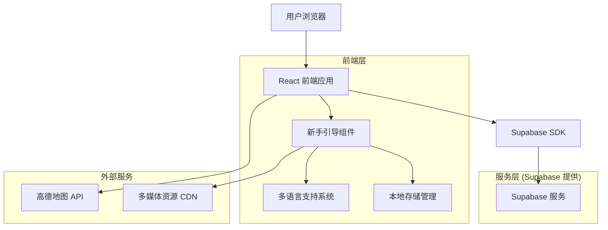
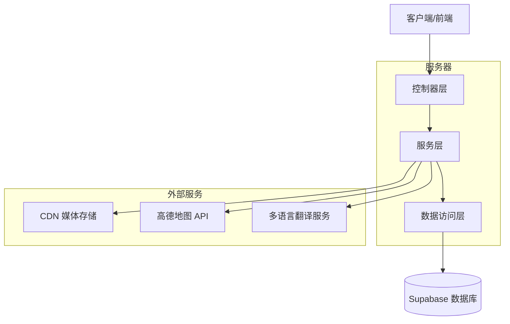
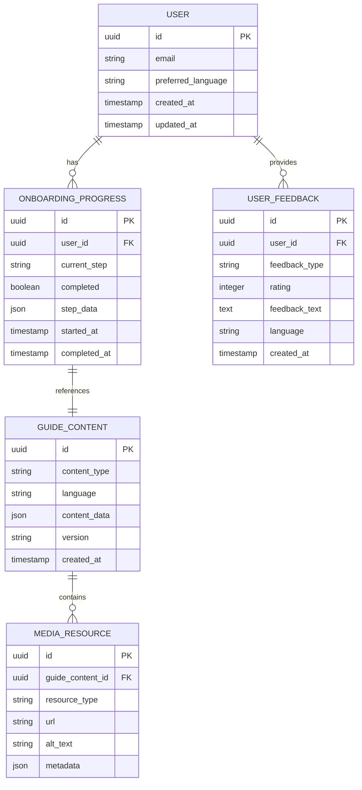

# 新手引导功能技术架构文档

## 1. 架构设计



## 2. 技术描述

- 前端：React@18 + TypeScript + Tailwind CSS + Framer Motion + React i18next
- 后端：Supabase (PostgreSQL + Auth + Storage)
- 地图服务：高德地图 API
- 多媒体：CDN 存储的引导视频和图片
- 状态管理：Zustand + localStorage

## 3. 路由定义

| 路由 | 用途 |
|------|------|
| /onboarding | 新手引导主页面，包含语言选择和引导流程 |
| /onboarding/language | 语言选择页面 |
| /onboarding/payment-intro | 支付方式介绍页面 |
| /onboarding/tutorial | 交互式教程页面 |
| /onboarding/complete | 引导完成页面 |
| /guide/payments | 支付指南页面 |
| /guide/pos-usage | POS机使用指南 |
| /guide/faq | 常见问题页面 |
| /help | 帮助中心页面 |

## 4. API 定义

### 4.1 核心 API

用户引导进度相关
```
POST /api/onboarding/progress
```

请求：
| 参数名 | 参数类型 | 是否必需 | 描述 |
|--------|----------|----------|------|
| user_id | string | true | 用户ID |
| step | string | true | 当前完成的引导步骤 |
| language | string | true | 用户选择的语言 |
| completed | boolean | true | 是否完成引导 |

响应：
| 参数名 | 参数类型 | 描述 |
|--------|----------|------|
| success | boolean | 操作是否成功 |
| progress | object | 用户引导进度信息 |

示例：
```json
{
  "user_id": "uuid-123",
  "step": "payment-intro",
  "language": "en",
  "completed": false
}
```

多语言内容获取
```
GET /api/content/guide
```

请求：
| 参数名 | 参数类型 | 是否必需 | 描述 |
|--------|----------|----------|------|
| language | string | true | 语言代码 (en/ru/de/zh) |
| type | string | true | 内容类型 (payment-guide/pos-tutorial/faq) |

响应：
| 参数名 | 参数类型 | 描述 |
|--------|----------|------|
| content | object | 多语言内容数据 |
| media_urls | array | 相关媒体资源URL |

用户反馈收集
```
POST /api/feedback/onboarding
```

请求：
| 参数名 | 参数类型 | 是否必需 | 描述 |
|--------|----------|----------|------|
| user_id | string | false | 用户ID (可匿名) |
| rating | number | true | 评分 (1-5) |
| feedback | string | false | 文字反馈 |
| language | string | true | 反馈语言 |

## 5. 服务器架构图



## 6. 数据模型

### 6.1 数据模型定义



### 6.2 数据定义语言

用户引导进度表 (onboarding_progress)
```sql
-- 创建表
CREATE TABLE onboarding_progress (
    id UUID PRIMARY KEY DEFAULT gen_random_uuid(),
    user_id UUID REFERENCES auth.users(id) ON DELETE CASCADE,
    current_step VARCHAR(50) NOT NULL,
    completed BOOLEAN DEFAULT FALSE,
    step_data JSONB DEFAULT '{}',
    started_at TIMESTAMP WITH TIME ZONE DEFAULT NOW(),
    completed_at TIMESTAMP WITH TIME ZONE,
    created_at TIMESTAMP WITH TIME ZONE DEFAULT NOW(),
    updated_at TIMESTAMP WITH TIME ZONE DEFAULT NOW()
);

-- 创建索引
CREATE INDEX idx_onboarding_progress_user_id ON onboarding_progress(user_id);
CREATE INDEX idx_onboarding_progress_step ON onboarding_progress(current_step);
CREATE INDEX idx_onboarding_progress_completed ON onboarding_progress(completed);

-- 行级安全策略
ALTER TABLE onboarding_progress ENABLE ROW LEVEL SECURITY;

CREATE POLICY "Users can view own onboarding progress" ON onboarding_progress
    FOR SELECT USING (auth.uid() = user_id);

CREATE POLICY "Users can update own onboarding progress" ON onboarding_progress
    FOR UPDATE USING (auth.uid() = user_id);

CREATE POLICY "Users can insert own onboarding progress" ON onboarding_progress
    FOR INSERT WITH CHECK (auth.uid() = user_id);

-- 权限设置
GRANT SELECT ON onboarding_progress TO anon;
GRANT ALL PRIVILEGES ON onboarding_progress TO authenticated;
```

引导内容表 (guide_content)
```sql
-- 创建表
CREATE TABLE guide_content (
    id UUID PRIMARY KEY DEFAULT gen_random_uuid(),
    content_type VARCHAR(50) NOT NULL, -- 'payment-guide', 'pos-tutorial', 'faq'
    language VARCHAR(5) NOT NULL, -- 'en', 'ru', 'de', 'zh'
    content_data JSONB NOT NULL,
    version VARCHAR(20) DEFAULT '1.0.0',
    is_active BOOLEAN DEFAULT TRUE,
    created_at TIMESTAMP WITH TIME ZONE DEFAULT NOW(),
    updated_at TIMESTAMP WITH TIME ZONE DEFAULT NOW()
);

-- 创建索引
CREATE INDEX idx_guide_content_type_language ON guide_content(content_type, language);
CREATE INDEX idx_guide_content_active ON guide_content(is_active);

-- 唯一约束
CREATE UNIQUE INDEX idx_guide_content_unique ON guide_content(content_type, language, version) 
WHERE is_active = TRUE;

-- 行级安全策略
ALTER TABLE guide_content ENABLE ROW LEVEL SECURITY;

CREATE POLICY "Guide content is publicly readable" ON guide_content
    FOR SELECT USING (is_active = TRUE);

CREATE POLICY "Only admins can modify guide content" ON guide_content
    FOR ALL USING (auth.jwt() ->> 'role' = 'admin');

-- 权限设置
GRANT SELECT ON guide_content TO anon;
GRANT ALL PRIVILEGES ON guide_content TO authenticated;
```

媒体资源表 (media_resources)
```sql
-- 创建表
CREATE TABLE media_resources (
    id UUID PRIMARY KEY DEFAULT gen_random_uuid(),
    guide_content_id UUID REFERENCES guide_content(id) ON DELETE CASCADE,
    resource_type VARCHAR(20) NOT NULL, -- 'image', 'video', 'audio'
    url TEXT NOT NULL,
    alt_text TEXT,
    metadata JSONB DEFAULT '{}',
    file_size BIGINT,
    mime_type VARCHAR(100),
    created_at TIMESTAMP WITH TIME ZONE DEFAULT NOW()
);

-- 创建索引
CREATE INDEX idx_media_resources_guide_content ON media_resources(guide_content_id);
CREATE INDEX idx_media_resources_type ON media_resources(resource_type);

-- 行级安全策略
ALTER TABLE media_resources ENABLE ROW LEVEL SECURITY;

CREATE POLICY "Media resources are publicly readable" ON media_resources
    FOR SELECT USING (TRUE);

-- 权限设置
GRANT SELECT ON media_resources TO anon;
GRANT ALL PRIVILEGES ON media_resources TO authenticated;
```

用户反馈表 (user_feedback)
```sql
-- 创建表
CREATE TABLE user_feedback (
    id UUID PRIMARY KEY DEFAULT gen_random_uuid(),
    user_id UUID REFERENCES auth.users(id) ON DELETE SET NULL,
    feedback_type VARCHAR(50) NOT NULL, -- 'onboarding', 'general', 'bug-report'
    rating INTEGER CHECK (rating >= 1 AND rating <= 5),
    feedback_text TEXT,
    language VARCHAR(5) NOT NULL,
    user_agent TEXT,
    ip_address INET,
    created_at TIMESTAMP WITH TIME ZONE DEFAULT NOW()
);

-- 创建索引
CREATE INDEX idx_user_feedback_type ON user_feedback(feedback_type);
CREATE INDEX idx_user_feedback_rating ON user_feedback(rating);
CREATE INDEX idx_user_feedback_created_at ON user_feedback(created_at DESC);

-- 行级安全策略
ALTER TABLE user_feedback ENABLE ROW LEVEL SECURITY;

CREATE POLICY "Users can view own feedback" ON user_feedback
    FOR SELECT USING (auth.uid() = user_id OR user_id IS NULL);

CREATE POLICY "Anyone can insert feedback" ON user_feedback
    FOR INSERT WITH CHECK (TRUE);

CREATE POLICY "Admins can view all feedback" ON user_feedback
    FOR SELECT USING (auth.jwt() ->> 'role' = 'admin');

-- 权限设置
GRANT SELECT, INSERT ON user_feedback TO anon;
GRANT ALL PRIVILEGES ON user_feedback TO authenticated;
```

初始化引导内容数据
```sql
-- 插入英语支付指南内容
INSERT INTO guide_content (content_type, language, content_data) VALUES
('payment-guide', 'en', '{
  "title": "Payment Methods in China",
  "sections": [
    {
      "title": "Mobile Payments",
      "content": "Alipay and WeChat Pay are the most popular mobile payment methods in China.",
      "steps": [
        "Download the app",
        "Register with your phone number",
        "Link your bank card or use international cards",
        "Scan QR codes to pay"
      ]
    },
    {
      "title": "International Cards",
      "content": "Many merchants accept Visa, MasterCard, and other international cards.",
      "tips": [
        "Look for card acceptance logos",
        "Inform your bank about travel plans",
        "Have backup payment methods"
      ]
    }
  ]
}'),
('pos-tutorial', 'en', '{
  "title": "How to Use POS Machines",
  "steps": [
    {
      "step": 1,
      "title": "Locate the POS Machine",
      "description": "Look for the payment terminal at the checkout counter",
      "image": "/images/pos-location.jpg"
    },
    {
      "step": 2,
      "title": "Choose Payment Method",
      "description": "Select card payment or mobile payment option",
      "image": "/images/payment-options.jpg"
    },
    {
      "step": 3,
      "title": "Complete Payment",
      "description": "Insert/tap your card or scan QR code",
      "image": "/images/payment-process.jpg"
    }
  ]
}'),
('faq', 'en', '{
  "title": "Frequently Asked Questions",
  "questions": [
    {
      "question": "Can I use my foreign credit card in China?",
      "answer": "Yes, many merchants accept international cards like Visa and MasterCard. Look for the card logos at the store."
    },
    {
      "question": "How do I set up mobile payments?",
      "answer": "Download Alipay or WeChat Pay, register with your phone number, and link an international card or Chinese bank account."
    },
    {
      "question": "What if my payment fails?",
      "answer": "Try an alternative payment method, check your card limits, or ask the merchant for assistance."
    }
  ]
}');
```