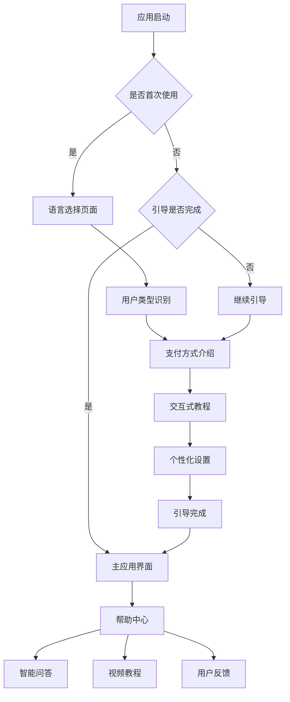

# 新手引导功能设计文档

## 1. 产品概述

针对外国来华人士设计的智能新手引导系统，通过多语言支持、交互式教程和个性化指导，帮助外国用户快速掌握中国移动支付和POS机使用方法，解决支付困难和文化差异问题。

- 解决外国用户在中国使用移动支付的痛点，提供直观易懂的操作指导
- 通过多语言支持（英语、俄语、德语、中文）和文化适配，降低使用门槛
- 提升用户体验，增加用户留存率和应用使用频率

## 2. 核心功能

### 2.1 用户角色

| 角色 | 注册方式 | 核心权限 |
|------|----------|----------|
| 新用户 | 首次打开应用 | 可访问完整新手引导流程，获得基础功能介绍 |
| 注册用户 | 邮箱注册或第三方登录 | 可保存引导进度，获得个性化推荐和高级功能 |
| 管理员 | 后台邀请 | 可管理引导内容，查看用户反馈和使用数据 |

### 2.2 功能模块

我们的新手引导系统包含以下主要页面：
1. **引导欢迎页**：语言选择、用户类型识别、引导流程预览
2. **支付方式介绍页**：移动支付、银行卡支付、现金支付的详细说明
3. **交互式教程页**：POS机使用模拟、支付流程演示、常见场景练习
4. **个性化设置页**：语言偏好、支付习惯、提醒设置
5. **帮助中心页**：常见问题、联系客服、用户反馈
6. **引导完成页**：成就展示、下一步建议、应用功能导览

### 2.3 页面详情

| 页面名称 | 模块名称 | 功能描述 |
|----------|----------|----------|
| 引导欢迎页 | 语言选择器 | 提供英语、俄语、德语、中文四种语言选择，自动检测系统语言 |
| 引导欢迎页 | 用户类型识别 | 识别用户身份（游客、商务人士、留学生等），提供个性化引导路径 |
| 引导欢迎页 | 流程预览 | 展示引导步骤概览，预估完成时间，允许跳过某些步骤 |
| 支付方式介绍页 | 移动支付指南 | 详细介绍支付宝、微信支付的注册、绑卡、使用流程，包含视频教程 |
| 支付方式介绍页 | 银行卡支付说明 | 说明国际信用卡在中国的使用方法，POS机操作步骤 |
| 支付方式介绍页 | 支付场景演示 | 展示餐厅、商店、交通等不同场景的支付方式选择 |
| 交互式教程页 | POS机模拟器 | 3D交互式POS机操作模拟，支持触摸和手势操作 |
| 交互式教程页 | 支付流程演练 | 分步骤引导用户完成虚拟支付操作，实时反馈和纠错 |
| 交互式教程页 | 问题解决训练 | 模拟支付失败、网络问题等常见情况的处理方法 |
| 个性化设置页 | 偏好配置 | 设置语言、货币显示、支付方式偏好、通知设置 |
| 个性化设置页 | 学习进度 | 显示引导完成进度，解锁的功能和成就 |
| 帮助中心页 | 智能问答 | AI驱动的多语言问答系统，支持语音和文字输入 |
| 帮助中心页 | 视频教程库 | 分类整理的支付教程视频，支持多语言字幕 |
| 帮助中心页 | 用户反馈 | 收集用户体验反馈，支持匿名提交和评分 |
| 引导完成页 | 成就系统 | 展示用户完成的引导模块，颁发虚拟徽章和证书 |
| 引导完成页 | 功能推荐 | 基于用户类型推荐相关应用功能和使用技巧 |

## 3. 核心流程

### 新用户引导流程
用户首次打开应用 → 语言选择 → 用户类型识别 → 支付方式介绍 → 交互式教程 → 个性化设置 → 引导完成 → 进入主应用

### 返回用户流程
用户再次打开应用 → 检测引导进度 → 继续未完成的引导 → 或直接进入主应用 → 可随时访问帮助中心

### 管理员流程
管理员登录 → 查看用户引导数据 → 更新引导内容 → 分析用户反馈 → 优化引导流程

## 4. 用户界面设计

### 4.1 设计风格

- **主色调**：蓝色系 (#2563EB 主蓝色，#3B82F6 辅助蓝色)，传达信任和专业感
- **辅助色**：绿色 (#10B981 成功色)，橙色 (#F59E0B 警告色)，红色 (#EF4444 错误色)
- **按钮样式**：圆角矩形设计，支持触摸反馈和动画效果
- **字体**：中文使用思源黑体，英文使用 Inter，俄语和德语使用 Roboto
- **字体大小**：标题 24px，正文 16px，说明文字 14px，确保多语言显示效果
- **布局风格**：卡片式设计，顶部导航栏，底部操作按钮
- **图标风格**：线性图标配合填充图标，支持多语言标识和文化适配
- **动画效果**：使用 Framer Motion 实现流畅的页面切换和交互动画

### 4.2 页面设计概览

| 页面名称 | 模块名称 | UI元素 |
|----------|----------|--------|
| 引导欢迎页 | 语言选择器 | 4个语言卡片，国旗图标，语言名称（本地化显示），选中状态高亮，动画切换效果 |
| 引导欢迎页 | 用户类型识别 | 图标化的用户类型选项（游客、商务、留学生），描述文字，单选交互 |
| 引导欢迎页 | 流程预览 | 步骤指示器，进度条，预估时间显示，跳过选项 |
| 支付方式介绍页 | 移动支付指南 | 支付宝/微信支付 Logo，分步骤图文说明，视频播放器，操作按钮 |
| 支付方式介绍页 | 银行卡支付说明 | 信用卡图标，POS机图片，操作流程图，注意事项提示 |
| 交互式教程页 | POS机模拟器 | 3D POS机模型，可点击的按钮和屏幕，操作指引箭头，实时反馈 |
| 交互式教程页 | 支付流程演练 | 分步骤界面，操作提示，进度指示，错误提示和纠正 |
| 个性化设置页 | 偏好配置 | 设置项列表，开关按钮，下拉选择器，保存确认 |
| 帮助中心页 | 智能问答 | 聊天界面，语音输入按钮，快速问题按钮，多语言切换 |
| 帮助中心页 | 视频教程库 | 视频缩略图网格，分类标签，搜索框，播放控制 |
| 引导完成页 | 成就系统 | 徽章展示，完成度环形图，分享按钮，继续探索按钮 |

### 4.3 响应式设计

- **设计优先级**：移动端优先设计，适配平板和桌面端
- **触摸优化**：按钮最小尺寸 44px，手势支持（滑动、缩放、长按）
- **屏幕适配**：支持 iPhone SE (375px) 到 iPad Pro (1024px) 的屏幕尺寸
- **横竖屏切换**：自动调整布局，保持操作便利性
- **无障碍支持**：支持屏幕阅读器，高对比度模式，大字体显示

## 5. 特殊需求

### 5.1 多语言支持

- **语言覆盖**：英语、俄语、德语、简体中文
- **本地化内容**：不仅翻译文字，还要适配文化习惯和表达方式
- **RTL支持**：为未来支持阿拉伯语等从右到左的语言做准备
- **语言切换**：实时切换，无需重启应用
- **字体优化**：针对不同语言选择最佳字体，确保显示效果

### 5.2 文化适配

- **支付习惯**：了解不同国家用户的支付偏好和习惯
- **颜色文化**：避免使用在某些文化中有负面含义的颜色
- **图标设计**：使用国际通用的图标，避免文化误解
- **内容本地化**：提供符合当地法规和习惯的支付指导

### 5.3 技术要求

- **离线支持**：核心引导内容支持离线访问
- **性能优化**：首屏加载时间 < 2秒，动画流畅度 60fps
- **数据统计**：记录用户引导行为，用于优化引导流程
- **A/B测试**：支持不同引导方案的对比测试
- **错误处理**：优雅的错误提示和恢复机制
- **安全性**：用户数据加密存储，隐私保护

## 6. 用户体验优化

### 6.1 个性化引导

- 根据用户类型（游客、商务人士、留学生）提供定制化引导内容
- 智能推荐最相关的支付方式和使用场景
- 记住用户偏好，避免重复不必要的步骤

### 6.2 交互优化

- 使用渐进式披露，避免信息过载
- 提供跳过选项，让有经验的用户快速通过
- 实时反馈和鼓励，增强用户完成引导的动力

### 6.3 内容优化

- 使用简洁明了的语言，避免技术术语
- 提供多媒体内容（图片、视频、动画）增强理解
- 定期更新内容，确保信息的准确性和时效性

### 6.4 可访问性

- 支持屏幕阅读器和语音导航
- 提供高对比度模式和大字体选项
- 支持键盘导航和外接设备操作