# 玩卡爱好者地图应用 - 项目功能总览文档

## 1. 项目概述

玩卡爱好者地图应用是一个专为支付方式查询和管理设计的Web应用，特别针对外国来华人士的支付需求进行了深度优化。应用通过智能地图展示、多语言支持和新手引导系统，帮助用户快速找到支持各种支付方式的商户和POS机。

- **目标用户**：玩卡爱好者、外国来华人士、移动支付用户
- **核心价值**：解决支付方式查询困难，提升支付体验，降低支付失败率
- **市场定位**：中国领先的支付方式查询和指导平台

## 2. 功能架构图

```mermaid
graph TD
    A[玩卡爱好者地图应用] --> B[核心功能模块]
    A --> C[用户体验模块]
    A --> D[管理功能模块]
    
    B --> E[地图展示系统]
    B --> F[商户信息管理]
    B --> G[支付方式查询]
    B --> H[用户系统]
    
    C --> I[多语言支持]
    C --> J[新手引导系统]
    C --> K[外国用户优化]
    C --> L[移动端适配]
    
    D --> M[Beta用户管理]
    D --> N[数据统计分析]
    D --> O[内容管理系统]
    D --> P[客服支持系统]
    
    E --> E1[高德地图集成]
    E --> E2[实时位置定位]
    E --> E3[商户标记显示]
    E --> E4[路径规划]
    
    F --> F1[商户信息录入]
    F --> F2[支付方式标记]
    F --> F3[营业状态更新]
    F --> F4[用户评价管理]
    
    G --> G1[支付方式筛选]
    G --> G2[POS机类型查询]
    G --> G3[国际卡支持查询]
    G --> G4[实时可用性检查]
    
    H --> H1[用户注册登录]
    H --> H2[个人资料管理]
    H --> H3[偏好设置]
    H --> H4[使用历史记录]
    
    I --> I1[四语言支持]
    I --> I2[实时语言切换]
    I --> I3[本地化内容]
    I --> I4[文化适配]
    
    J --> J1[交互式教程]
    J --> J2[支付方式介绍]
    J --> J3[POS机使用指导]
    J --> J4[常见问题解答]
    
    K --> K1[国际卡优先显示]
    K --> K2[多语言客服]
    K --> K3[文化礼仪指导]
    K --> K4[紧急支援系统]
```

## 3. 详细功能清单

### 3.1 已实现功能 ✅

#### 核心地图功能
- **地图展示系统**
  - 基于高德地图的交互式地图界面
  - 实时用户位置定位和显示
  - 商户位置标记和信息展示
  - 地图缩放、拖拽、搜索功能
  - 响应式地图适配移动端

#### 用户系统
- **用户注册和登录**
  - 邮箱注册和登录功能
  - 用户密码加密存储
  - 登录状态持久化
  - 用户会话管理

- **个人资料管理**
  - 用户基本信息编辑
  - 头像上传和管理
  - 偏好设置保存
  - 账户安全设置

#### 商户信息管理
- **商户数据管理**
  - 商户信息的增删改查
  - 支付方式标记和更新
  - 商户分类和标签管理
  - 营业时间和状态管理

#### 支付方式展示
- **支付图标系统**
  - 支付宝、微信支付、银联等图标展示
  - 国际信用卡品牌图标（Visa、MasterCard、AmEx等）
  - 支付方式可用性状态指示
  - 图标样式统一和美化

#### 多语言国际化
- **四语言支持**
  - 中文（简体）、英语、俄语、德语
  - 完整的翻译文件和本地化内容
  - 实时语言切换功能
  - 语言偏好本地存储

- **语言切换组件**
  - 直观的语言选择界面
  - 国旗图标和语言名称显示
  - 无刷新语言切换
  - 语言设置持久化

#### 移动端优化
- **响应式设计**
  - 移动端优先的界面设计
  - 触摸友好的交互元素
  - 适配各种屏幕尺寸
  - 横竖屏自动适配

#### Beta用户权限系统
- **权限管理**
  - Beta用户权限验证
  - 功能访问控制
  - 用户角色管理
  - 权限升级机制

### 3.2 开发中功能 🚧

#### 新手引导系统
- **交互式引导流程**
  - 首次使用引导向导
  - 分步骤功能介绍
  - 交互式操作演示
  - 引导进度保存和恢复

- **支付方式教育**
  - 各种支付方式详细介绍
  - 使用方法分步指导
  - 常见问题和解决方案
  - 视频教程和图文说明

- **POS机使用指导**
  - POS机类型识别指南
  - 操作步骤详细说明
  - 常见错误和处理方法
  - 交互式模拟练习

#### 外国用户支付体验优化
- **智能用户识别**
  - 自动语言和地区检测
  - 用户类型智能识别
  - 个性化欢迎和推荐
  - 文化背景适配

- **国际卡支持优化**
  - 支持国际卡的商户优先显示
  - 国际卡使用指导和注意事项
  - 汇率信息和手续费提醒
  - 支付限额和限制说明

- **多语言客服支持**
  - 实时多语言在线客服
  - 智能问答系统
  - 常见问题快速解答
  - 紧急支援联系方式

#### 智能问答和帮助中心
- **AI驱动问答系统**
  - 自然语言问题理解
  - 智能答案匹配和推荐
  - 多语言问答支持
  - 学习型问答优化

- **帮助中心**
  - 分类整理的帮助文档
  - 搜索功能和标签筛选
  - 用户反馈和评价系统
  - 内容更新和维护

#### 高级搜索和筛选
- **智能搜索**
  - 商户名称和地址搜索
  - 支付方式组合筛选
  - 距离和评分排序
  - 搜索历史和建议

- **高级筛选**
  - 多维度筛选条件
  - 自定义筛选组合
  - 筛选结果保存
  - 筛选偏好记忆

#### 用户评价和评分系统
- **商户评价**
  - 用户评分和评论功能
  - 支付体验评价
  - 服务质量反馈
  - 评价真实性验证

- **评价展示**
  - 评分统计和趋势
  - 评论内容展示
  - 有用性投票
  - 评价筛选和排序

#### 商户认证和验证
- **商户认证系统**
  - 商户身份验证流程
  - 营业执照和资质审核
  - 认证标识和等级
  - 认证信息更新

- **信息验证**
  - 用户提交信息审核
  - 众包验证机制
  - 信息准确性评分
  - 虚假信息举报

### 3.3 计划中功能 📋

#### POS机使用模拟器
- **3D交互模拟**
  - 真实POS机3D模型
  - 触摸和手势操作模拟
  - 不同品牌POS机适配
  - 操作步骤实时指导

- **模拟练习系统**
  - 安全的练习环境
  - 各种支付场景模拟
  - 错误操作纠正
  - 练习成果评估

#### 个性化支付推荐
- **智能推荐算法**
  - 基于用户行为的推荐
  - 位置和时间智能分析
  - 支付成功率优化
  - 个人偏好学习

- **推荐系统**
  - 商户个性化推荐
  - 支付方式建议
  - 最优路径规划
  - 实时推荐更新

#### 用户反馈和评价系统
- **反馈收集**
  - 多渠道反馈收集
  - 匿名反馈支持
  - 反馈分类和标签
  - 反馈处理跟踪

- **评价分析**
  - 用户满意度分析
  - 功能使用情况统计
  - 改进建议提取
  - 产品优化指导

#### 离线地图支持
- **离线数据**
  - 关键区域地图缓存
  - 商户信息离线存储
  - 离线搜索功能
  - 数据同步机制

- **离线功能**
  - 无网络环境下的基础功能
  - 离线导航和定位
  - 缓存数据管理
  - 网络恢复后同步

#### 社交分享功能
- **分享机制**
  - 商户信息分享
  - 支付体验分享
  - 社交媒体集成
  - 分享统计和分析

- **社区功能**
  - 用户社区建设
  - 经验分享平台
  - 互助问答
  - 社区活动组织

#### 数据分析和统计
- **用户行为分析**
  - 用户使用路径分析
  - 功能使用频率统计
  - 用户留存率分析
  - 转化率优化

- **商业智能**
  - 商户热度分析
  - 支付趋势统计
  - 市场需求预测
  - 业务决策支持

#### 推送通知系统
- **智能推送**
  - 个性化消息推送
  - 位置相关通知
  - 支付提醒和建议
  - 系统更新通知

- **推送管理**
  - 推送偏好设置
  - 推送时间控制
  - 推送效果分析
  - 推送内容优化

## 4. 技术架构概览

### 4.1 前端技术栈
- **框架**：React 18 + TypeScript
- **样式**：Tailwind CSS + 自定义组件库
- **路由**：React Router DOM
- **状态管理**：Zustand + React Context
- **国际化**：React i18next
- **地图**：高德地图 JavaScript API
- **动画**：Framer Motion
- **构建工具**：Vite

### 4.2 后端技术栈
- **BaaS平台**：Supabase
- **数据库**：PostgreSQL（Supabase提供）
- **认证**：Supabase Auth
- **存储**：Supabase Storage
- **实时功能**：Supabase Realtime

### 4.3 外部服务
- **地图服务**：高德地图API
- **CDN**：用于静态资源和媒体文件
- **监控**：应用性能监控和错误追踪
- **分析**：用户行为分析和统计

## 5. 开发优先级

### 5.1 高优先级（P0）
1. 新手引导系统核心功能
2. 外国用户支付体验优化
3. 多语言客服支持系统
4. 智能问答和帮助中心

### 5.2 中优先级（P1）
1. POS机使用模拟器
2. 个性化支付推荐
3. 高级搜索和筛选功能
4. 用户评价和评分系统

### 5.3 低优先级（P2）
1. 离线地图支持
2. 社交分享功能
3. 数据分析和统计
4. 推送通知系统

## 6. 质量保证

### 6.1 测试策略
- **单元测试**：核心业务逻辑测试覆盖率 > 80%
- **集成测试**：API接口和数据库操作测试
- **端到端测试**：关键用户流程自动化测试
- **多语言测试**：各语言版本功能一致性测试
- **性能测试**：页面加载速度和响应时间测试
- **兼容性测试**：多设备和浏览器兼容性测试

### 6.2 代码质量
- **代码规范**：ESLint + Prettier 代码格式化
- **类型安全**：TypeScript 严格模式
- **代码审查**：Pull Request 代码审查流程
- **文档维护**：API文档和组件文档更新

### 6.3 用户体验
- **可用性测试**：真实用户使用体验测试
- **无障碍性**：WCAG 2.1 无障碍标准遵循
- **性能优化**：首屏加载时间 < 3秒
- **错误处理**：友好的错误提示和恢复机制

## 7. 项目里程碑

### 7.1 第一阶段（已完成）
- ✅ 基础地图功能实现
- ✅ 用户系统搭建
- ✅ 多语言支持集成
- ✅ 移动端适配完成

### 7.2 第二阶段（进行中）
- 🚧 新手引导系统开发
- 🚧 外国用户优化功能
- 🚧 智能问答系统
- 🚧 高级搜索功能

### 7.3 第三阶段（计划中）
- 📋 POS机模拟器开发
- 📋 个性化推荐系统
- 📋 社区功能建设
- 📋 数据分析平台

### 7.4 第四阶段（远期规划）
- 📋 移动端App开发
- 📋 AI智能助手
- 📋 企业级服务
- 📋 国际化扩展

## 8. 成功指标

### 8.1 用户指标
- **用户注册率**：月新增用户 > 1000
- **用户留存率**：7日留存率 > 60%
- **用户满意度**：应用评分 > 4.5/5
- **支付成功率**：用户支付成功率 > 90%

### 8.2 功能指标
- **引导完成率**：新手引导完成率 > 80%
- **搜索成功率**：用户搜索成功率 > 95%
- **客服满意度**：客服服务满意度 > 4.0/5
- **多语言使用率**：非中文用户占比 > 30%

### 8.3 技术指标
- **页面加载速度**：首屏加载时间 < 3秒
- **系统可用性**：服务可用率 > 99.5%
- **错误率**：系统错误率 < 0.1%
- **响应时间**：API响应时间 < 500ms