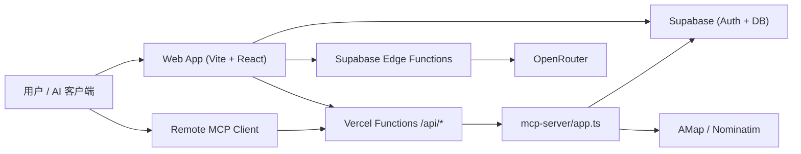

# Fluxa Map 开发说明文档

本文档基于当前仓库代码、脚本、迁移文件和已存在文档整理，适用范围仅限当前仓库 `/Users/williamwang/Downloads/项目/Fluxa Map`。工作区中的 `Payments-Maps`、`payments-fluxa-worktree.CqAAfJ` 等目录不在本文档覆盖范围内。

## 1. 项目概览

### 1.1 这个项目是做什么的

Fluxa Map 是一个“支付地点数据工作台”。它把以下能力放进同一个系统：

- 地图 / 列表 / 品牌目录浏览
- 支付地点录入与详情查看
- 支付尝试记录维护
- 品牌目录维护
- 个人卡册管理
- 浏览历史和个人资料
- MCP 授权，让外部 AI 客户端在受控范围内读取和写入 Fluxa 数据
- AI 辅助地点录入、品牌匹配、商户名称推断
- 管理员批量从地图 POI 导入品牌门店

### 1.2 核心业务流程

1. 用户通过 Supabase OAuth 登录。
2. 前端根据当前路由进入地图、列表、品牌、个人资料或历史页面。
3. 前端通过 `src/services/*` 从 Supabase 读取地点、品牌、卡册、用户资料。
4. 新增地点有三条主路径：
   - 手工新增真实地点：写入 `pos_machines`，同时创建首条 `pos_attempts`
   - 新增壳地点：写入 `fluxa_locations`，不写支付尝试
   - 管理员批量导入：先做地图搜索和去重，再批量写入壳地点或真实地点
5. 用户可在详情页继续补充尝试记录、删除地点、查看评论/评价。
6. 如果启用 MCP，用户可创建会话，把授权后的连接地址交给 Codex、Claude Desktop、Cherry Studio 等 AI 客户端。

### 1.3 主要用户是谁

- 内部运营 / 数据维护人员：维护品牌、地点、覆盖情况
- 现场贡献者 / 志愿者：录入真实支付地点和尝试记录
- 管理员：批量导入品牌门店、删除地点、执行高权限校验
- AI agent：通过 MCP 在授权范围内检索和写入业务数据

### 1.4 系统边界

属于本系统：

- React Web 应用
- Vercel Serverless API
- 独立 MCP Server
- Supabase 数据库访问、迁移和 Edge Functions

不属于本系统：

- AMap / Nominatim / OpenRouter 等外部服务本体
- Supabase 控制台中的 OAuth Provider 配置和远程历史数据
- 工作区中的其他项目副本或旧版本
- 设计稿 `.pen`、图片和 PDF 资料文件

### 1.5 哪些仓库 / 服务属于这个系统

属于本系统的代码和运行单元：

- 当前仓库根目录：前端 + Vercel API + Supabase 资产
- `mcp-server/`：Fluxa 的 MCP 服务实现
- 远程 Supabase 项目：由脚本 `supabase link --project-ref ytzmqzxspcuclffegazk` 指向
- Vercel 部署：由 `vercel.json` 定义构建与重写规则

明确不属于本系统的同工作区目录：

- `Payments-Maps`
- `payments-fluxa-worktree.CqAAfJ`

## 2. 快速开始

### 2.1 开发环境要求

当前机器上已验证可用的版本：

- Node.js `v25.1.0`
- npm `11.6.2`
- Supabase CLI `2.78.1`

建议至少满足：

- Node 20+
- npm 10+
- Supabase CLI 2.x

额外依赖：

- 可访问的 Supabase 项目
- 可用的 AMap Key
- 如需 AI 辅助录入，需要 OpenRouter Key
- 如需本地 MCP 独立运行，需要 `mcp-server/` 的依赖也安装完成

### 2.2 安装依赖

根项目和 MCP 子项目是两套 `package.json`，都要安装：

```bash
cd /Users/williamwang/Downloads/项目/Fluxa\ Map
npm install
npm --prefix ./mcp-server install
```

### 2.3 本地环境变量

前端 `.env`：

```bash
cp .env.example .env
```

字段说明：

- `VITE_SUPABASE_URL`: 前端使用的 Supabase URL
- `VITE_SUPABASE_ANON_KEY`: 前端匿名 Key
- `VITE_MCP_SERVER_URL`: 前端调用 MCP 会话管理接口的基地址，默认可指向 `http://localhost:3030`
- `VITE_AMAP_KEY`: AMap JS Key
- `VITE_AMAP_SECURITY_JS_CODE`: AMap 安全码

Supabase Functions：

```bash
cp supabase/functions/.env.example supabase/functions/.env
```

至少需要：

- `OPENROUTER_API_KEY`
- `OPENROUTER_MODEL` 或 `OPENROUTER_MODEL_PRIMARY`

MCP 服务端环境变量不是 `.env.example` 形式显式提供，但代码要求以下变量：

- `SUPABASE_URL`
- `SUPABASE_SERVICE_ROLE_KEY`
- `PORT`，默认 `3030`
- `HOST`，默认 `127.0.0.1`
- `MCP_PUBLIC_BASE_URL`
- `MCP_CORS_ORIGINS`
- `MCP_MAP_SEARCH_USER_AGENT`
- `MCP_MAP_SEARCH_CHROME_PATH`
- `VITE_AMAP_KEY`
- `VITE_AMAP_SECURITY_JS_CODE` 或 `VITE_AMAP_SECURITY_KEY`

### 2.4 启动本地环境

最小前端启动：

```bash
npm run dev
```

前端默认是 Vite 开发服务器，通常在 `http://localhost:5173`。

本地 MCP 服务：

```bash
npm run mcp:dev
```

或构建后直接启动：

```bash
npm run mcp:build
cd mcp-server
./run-local-server.sh
```

Supabase 本地容器：

```bash
npm run supabase:start
npm run supabase:status
```

本地运行 Edge Functions：

```bash
npm run supabase:functions:serve
npm run supabase:functions:serve:smart-add
```

说明：

- 前端可以连远程 Supabase，也可以连本地 Supabase
- MCP 服务单独运行时需要服务端密钥，不能只靠前端 `.env`
- Vercel 本地开发未在仓库中提供统一脚本，当前主要以 Vite + 独立 MCP + Supabase CLI 方式开发

### 2.5 如何跑测试

当前仓库没有自动化测试脚本，也没有发现独立测试目录。现阶段的最小检查是：

```bash
npm run typecheck
npm run mcp:typecheck
npm run build
```

2026-03-22 已在当前仓库执行并通过：

- `npm run typecheck`
- `npm run mcp:typecheck`
- `npm run build`

### 2.6 如何构建 / 发布

前端构建：

```bash
npm run build
```

MCP 服务构建：

```bash
npm run mcp:build
```

Supabase 数据库迁移：

```bash
npm run supabase:db:push
```

Supabase Edge Functions 部署：

```bash
npm run supabase:functions:deploy:merchant
npm run supabase:functions:deploy:brand
npm run supabase:functions:deploy:smart-add
```

Vercel 发布：

- 仓库通过 `vercel.json` 声明了 Vite 构建与 API 重写
- 仓库没有内置一键发布脚本
- 实际发布通常通过 Vercel 控制台、Git 集成，或手动执行 `vercel deploy`

### 2.7 常见启动失败排查

1. 页面能打开，但业务全是只读或空白
   - 检查 `.env` 里的 `VITE_SUPABASE_URL` 和 `VITE_SUPABASE_ANON_KEY`
   - `src/lib/supabase.ts` 在变量缺失时会退回 placeholder，并打印只读警告

2. 登录按钮报 “provider is not enabled”
   - 这是 Supabase OAuth Provider 没开启，不是前端问题
   - 需要去 Supabase 控制台启用 GitHub / Google / Microsoft 等 Provider

3. AMap 地图脚本加载失败
   - 检查 `VITE_AMAP_KEY` 和 `VITE_AMAP_SECURITY_JS_CODE`
   - 本地走 `/api/amap/js` 代理，生产也通过 Vercel Function 转发

4. MCP 设置页无法创建会话
   - 前端看 `VITE_MCP_SERVER_URL` 是否指向正确服务
   - 服务端看 `SUPABASE_URL` 和 `SUPABASE_SERVICE_ROLE_KEY` 是否存在
   - `/health` 可用于先确认 MCP 服务状态

5. AI 辅助录入报 500
   - 检查 `supabase/functions/.env` 是否设置了 `OPENROUTER_API_KEY`
   - 检查 Edge Function 是否已 `serve` 或已部署

6. `supabase db push` 后本地库仍缺表
   - 当前迁移只管理本仓库新增或补充的部分表
   - `brands`、`pos_machines`、`pos_attempts`、`users`、`reviews`、`comments`、`user_history` 等历史表不完全由本仓库定义
   - 新人若只起本地空库，很多读写能力会缺失

7. `npm run build` 通过但提示 chunk 很大
   - 这是当前已知状态，不阻塞发布
   - 说明客户端 bundle 较大，后续应考虑拆分路由或重做分包策略

## 3. 项目结构说明

### 3.1 顶层结构

```text
.
├── api/                    Vercel Serverless API 入口
├── docs/                   文档
├── mcp-server/             独立 MCP 服务
├── src/                    Web 前端源码
├── supabase/               迁移和 Edge Functions
├── public/                 静态资源
├── assets/ images/         品牌与设计资源
└── vercel.json             Vercel 构建与路由规则
```

### 3.2 `src/` 分层职责

`src/main.tsx`

- 只负责挂载 React 根节点和 `I18nProvider`
- 不承载业务逻辑

`src/root-app.tsx`

- 负责登录态恢复、OAuth 回调处理、登出
- 决定用户是进登录页还是主应用
- 不负责具体业务页面渲染细节

`src/App.tsx`

- 负责单页应用路由状态、页面级状态、Overlay 流程编排
- 是地图 / 列表 / 品牌 / 设置 / MCP / 新增地点等视图的协调层
- 不直接写数据库

`src/components/`

- 页面组件和复合业务组件
- 例如 `add-location-wizard.tsx`、`place-detail-web.tsx`、`web-mcp-settings.tsx`
- 负责界面交互和视图拼装
- 不应该堆积原始 Supabase 访问逻辑

`src/components/ui/`

- 底层 UI 原子组件，来自 shadcn 风格体系
- 负责通用展示和交互基础件
- 不应写业务条件分支

`src/hooks/`

- 面向业务场景的读取 / 写入 hook
- 负责加载态、错误态、本地缓存、分页/滚动模式等
- 当前项目的“状态管理”主要就在这里
- 不负责数据库字段映射细节

`src/services/`

- API / 数据访问层
- 负责 Supabase 查询、表结构兼容、行对象到领域对象的映射
- 是前端写库读库的主要边界
- 不负责页面状态

`src/lib/`

- 基础能力和跨模块工具
- 包括 Supabase 客户端、地图工具、搜索索引、MCP 请求客户端、AI 辅助工具
- 这里适合放纯函数、集成封装和协议工具

`src/types/`

- 领域类型定义
- 对前端消费的业务对象做统一建模
- 修改这里通常意味着多个 service / component 都会受影响

`src/data/`

- mock 或静态样例数据
- 不是生产真相源

### 3.3 `api/` 的职责

`api/` 不是完整后端，而是 Vercel Serverless 入口层：

- `/api/health`: 健康检查
- `/api/amap/js`: AMap JS 代理
- `/api/mcp/*`: MCP 会话管理和远程 MCP 接入

这些文件大多只是把请求转给 `mcp-server/src/app.ts`，真正逻辑不在 `api/` 本身。

### 3.4 `mcp-server/` 的职责

`mcp-server/` 是独立服务实现：

- Express 应用入口：`src/app.ts`
- 会话和权限：`src/session-service.ts`
- 业务读写封装：`src/fluxa-service.ts`
- 地图搜索：`src/map-search-service.ts`
- 审计日志：`src/audit-log-service.ts`

它的职责是对外提供：

- REST 会话管理接口
- Streamable HTTP MCP 连接端点
- 管理员品牌地图搜索 / 批量导入接口

### 3.5 `supabase/` 的职责

`supabase/migrations/`

- 管理本仓库新增和扩展的数据库对象
- 当前主要覆盖 `fluxa_locations`、`card_album_cards`、`mcp_sessions`、`mcp_tool_logs` 和若干列扩展

`supabase/functions/`

- 管理 AI 相关 Edge Functions
- `infer-merchant-name`
- `infer-brand-match`
- `assist-add-location`

注意：

- 远程库里还有历史业务表，但并不都在当前迁移目录里
- 因此 `supabase db reset` 得到的本地库不等于线上完整业务库

## 4. 架构说明

### 4.1 整体架构图



### 4.2 前后端关系

这个系统没有传统“单独后端仓库”。

实际是三层组合：

- 前端：React SPA
- 服务端接入层：Vercel Functions + 独立 MCP Express
- 数据与 AI：Supabase DB/Auth/Functions

前端直连 Supabase 做大部分读写；只有以下场景必须经过服务端：

- MCP 会话创建、撤销、远程连接
- 服务端管理员校验
- 服务角色密钥访问
- AMap JS 代理

### 4.3 服务调用关系

浏览器调用：

- `src/services/*` -> Supabase JS Client
- `src/lib/mcp-session-service.ts` -> `/api/mcp/*`
- `src/lib/amap.ts` -> `/api/amap/js`
- `src/services/ai-service.ts` -> Supabase Edge Functions

Vercel / MCP 调用：

- `api/*` -> `mcp-server/src/app.ts`
- `mcp-server/src/app.ts` -> `SessionService` + `FluxaService`
- `FluxaService` -> Supabase + 外部地图服务

### 4.4 核心数据流

新增真实地点：

1. 前端收集表单
2. `useFluxaLocations` -> `locationService.createLocation`
3. 写入 `pos_machines`
4. 在同一创建流程里再写首条 `pos_attempts`
5. 失效缓存并刷新地图、列表、搜索目录

新增壳地点：

1. 前端或 MCP 调用 `createShellLocation`
2. 只写 `fluxa_locations`
3. 不创建尝试记录

浏览地图：

1. 先拉轻量 map index
2. 依据 viewport 在前端分区
3. 按分区补拉真实地点详情
4. sessionStorage 缓存 map index，内存缓存已拉分区

MCP 会话创建：

1. 前端带 Supabase Access Token 调 `/api/mcp/sessions`
2. 服务端校验 bearer token
3. 生成 session token，数据库仅保存 hash
4. 返回连接 URL 给外部 AI 客户端

### 4.5 状态管理方式

当前项目没有 Redux / Zustand / React Query。

状态管理方式是：

- 页面级状态：`App.tsx` 中的 `useState`
- 数据加载与写入：`src/hooks/*`
- 模块级共享缓存：hook 文件内部的 `shared*Cache`
- 本地持久化：
  - `localStorage` 存语言、地图主题、Beta 开关
  - `sessionStorage` 存 map index 缓存

这意味着：

- 改 hook 缓存策略时，容易影响多个视图的一致性
- 没有统一失效中心，主要靠 `invalidate*Cache()` 手工维护

### 4.6 异步任务 / 消息队列 / cron

当前仓库没有消息队列、任务编排器或 cron 定义。

现有异步主要是：

- 浏览器内异步加载和后台预取
- Supabase Edge Functions 的即时调用
- MCP 工具调用
- 管理员批量导入时的 on-demand 批处理

### 4.7 缓存策略

前端缓存：

- 品牌目录、地点目录、map index 用模块级缓存
- 地图 index 额外持久化到 `sessionStorage`，TTL 15 分钟
- 视口分区结果保存在内存 Map 中

服务端 / HTTP 缓存：

- `/api/amap/js` 透传上游 `cache-control`，默认 5 分钟

注意：

- 任何写操作后都需要显式 `invalidate*Cache()`
- 若只改服务层不改失效逻辑，地图/列表/品牌页面会出现旧数据

### 4.8 鉴权方式

浏览器侧：

- 使用 Supabase Auth
- `root-app.tsx` 恢复 session，支持 OAuth 和手动 callback 调试

管理员识别：

- 通过 `user_metadata` 或 `app_metadata` 中的 `is_admin` / `admin` / `role` / `roles`
- 前端和 MCP 服务都各自实现了 admin 判定逻辑

MCP：

- 会话管理接口用 Supabase Access Token 鉴权
- 真正的 MCP 连接用 `sessionToken`
- 数据库里保存的是 `session_token_hash`，不是明文 token

服务端数据库访问：

- `mcp-server/src/supabase.ts` 使用 `SUPABASE_SERVICE_ROLE_KEY`
- 这是高权限客户端，只能在服务端运行

## 5. 领域模型 / 数据模型

### 5.1 核心实体

`Location`

- 前端统一领域对象
- 可能来自 `fluxa_locations` 或 `pos_machines`
- `source` 字段是来源真相

`Shell Location`

- 对应 `fluxa_locations`
- 表示“存在该门店，但还没有真实支付尝试”
- 适合批量铺点

`Verified POS Location`

- 对应 `pos_machines`
- 表示真实录入、可挂支付尝试的地点

`Location Attempt`

- 对应 `pos_attempts`
- 记录某次支付尝试和设备状态

`Brand`

- 对应 `brands`
- 维护品牌目录和品牌级统计

`Card Album Card`

- 对应 `card_album_cards`
- 支持 `public` 和 `personal`

`Browsing History`

- 对应 `user_history`
- 保存用户访问过的地点

`MCP Session`

- 对应 `mcp_sessions`
- 表示对某个外部 AI 客户端的授权会话

`MCP Tool Log`

- 对应 `mcp_tool_logs`
- 记录 MCP 调用审计摘要

### 5.2 实体关系

- `brands` 1 -> N `pos_machines`，通过 `brand_id`
- `fluxa_locations` 通过 `brand` 文本值挂品牌展示名，不是外键
- `pos_machines` 1 -> N `pos_attempts`
- `pos_machines` 1 -> N `reviews`
- `pos_machines` 1 -> N `comments`
- `users` 1 -> N `user_history`
- `users` 1 -> N `card_album_cards`，仅个人卡有 `user_id`
- `users` 1 -> N `mcp_sessions`
- `mcp_sessions` 1 -> N `mcp_tool_logs`

### 5.3 重要字段含义

`fluxa_locations.brand`

- 文本字段
- 当前品牌详情页对壳地点归属依赖这个展示名
- 不是品牌外键

`pos_machines.brand_id`

- 真实地点对品牌的结构化归属
- 是品牌统计和筛选的重要来源

`Location.source`

- 前端统一视图里的来源标记
- 真相值，不是派生装饰

`status`

- 地点层面只允许 `active` / `inactive`
- 设备状态与地点可用性会相互影响展示

`session_token_hash`

- MCP 会话明文 token 的哈希
- 属于安全真相源

`token_hint`

- 只是提示展示，不是鉴权真相

### 5.4 状态机

地点状态机：

- `active` -> `inactive`
- `inactive` -> `active`

当前项目没有更细的地点状态枚举，更多业务语义由尝试记录和备注表达。

MCP 会话状态机：

- 创建后为活跃
- 到期前可使用
- 撤销后不可再用
- 数据库存储通过 `revoked_at` 判断是否失效

卡册状态机：

- `public`
- `personal`

不支持更多生命周期状态。

### 5.5 真相源与派生值

真相源：

- `fluxa_locations` / `pos_machines`
- `pos_attempts`
- `brands`
- `card_album_cards`
- `user_history`
- `mcp_sessions`

派生值：

- `successRate`
- `storeCount`
- `activeStoreCount`
- `inactiveStoreCount`
- `primaryCity`
- `lastSyncAt`
- 列表统计数、地图可见数

修改派生逻辑通常不改表结构，但会影响多个页面和 MCP 输出。

### 5.6 当前数据库边界说明

本仓库迁移里能看到的表并不完整。当前可确认：

- 仓库显式管理：`fluxa_locations`、`card_album_cards`、`mcp_sessions`、`mcp_tool_logs`
- 仓库显式扩展：`brands`、`fluxa_locations`
- 仓库依赖但未完整定义：`brands`、`pos_machines`、`pos_attempts`、`reviews`、`comments`、`users`、`user_history`

这意味着本仓库不是“从零重建线上库”的完整 schema 源。

## 6. API / 接口契约

当前没有 OpenAPI / Swagger。权威源是：

- `mcp-server/src/app.ts`
- `src/lib/mcp-session-service.ts`
- `src/services/*`

### 6.1 REST 接口一览

| 方法 | 路径 | 鉴权 | 作用 |
| --- | --- | --- | --- |
| `GET` | `/health` / `/api/health` | 无 | 返回 MCP 服务健康状态 |
| `GET` | `/api/mcp/templates` | 无 | 返回会话模板列表 |
| `GET` | `/api/mcp/sessions` | `Authorization: Bearer <supabase access token>` | 列出当前用户的 MCP 会话 |
| `POST` | `/api/mcp/sessions` | Bearer | 创建 MCP 会话 |
| `POST` | `/api/mcp/sessions/:id/revoke` | Bearer | 撤销指定会话 |
| `POST` | `/api/mcp/sessions/revoke` | Bearer | 通过 body 里的 `id` 撤销会话 |
| `POST` | `/api/admin/brand-map-search` | Bearer + Admin | 地图搜索品牌门店 |
| `POST` | `/api/admin/brand-map-import` | Bearer | 批量导入品牌门店，内部再做管理员校验 |
| `ALL` | `/mcp/:sessionToken` / `/api/mcp/:sessionToken` / `/api/mcp/connect` | MCP Session Token | Remote MCP 连接入口 |
| `GET` | `/api/amap/js` | 无 | AMap JS 代理 |

### 6.2 典型请求 / 返回

创建 MCP 会话请求：

```json
{
  "sessionLabel": "Fluxa 桌面会话",
  "clientType": "codex",
  "scopeTemplate": "standard_user"
}
```

返回：

```json
{
  "session": {
    "id": "uuid",
    "sessionLabel": "Fluxa 桌面会话",
    "clientType": "codex",
    "scopeTemplate": "standard_user",
    "scopes": ["analytics.read", "locations.read"],
    "tokenHint": "xxxx...abcd",
    "lastUsedAt": null,
    "expiresAt": "2026-04-21T00:00:00.000Z",
    "revokedAt": null,
    "createdAt": "2026-03-22T00:00:00.000Z"
  },
  "sessionToken": "plain-token",
  "connectionUrl": "https://.../mcp/<sessionToken>",
  "publicBaseUrl": "https://..."
}
```

品牌地图搜索请求：

```json
{
  "brand": "星巴克 (Starbucks)",
  "area": "上海",
  "brandAliases": ["Starbucks", "星巴克"],
  "countryCode": "CN",
  "limit": 200
}
```

### 6.3 鉴权要求

- MCP 会话管理：必须带 Supabase Access Token
- 管理员地图搜索 / 导入：必须是管理员用户
- Remote MCP：使用 session token，不用 Supabase Access Token
- 前端直连 Supabase 的读写由 Supabase RLS 和当前登录态共同控制

### 6.4 错误码 / 错误结构

REST 接口统一风格：

```json
{
  "error": "Unable to create MCP session."
}
```

常见状态码：

- `400`: 参数错误、业务校验失败
- `401`: Bearer token 缺失或无效
- `405`: 方法不允许
- `500`: 上游或服务内部异常
- `503`: 服务端缺少 Supabase 服务角色配置

### 6.5 幂等性要求

当前没有通用 idempotency key 设计。

可以近似视为安全重试的操作：

- `POST /api/mcp/sessions/:id/revoke`
- `POST /api/mcp/sessions/revoke`

需要业务去重保护的操作：

- 创建地点
- 创建卡片
- 批量品牌导入

其中批量导入只有在 `skipExisting=true` 且去重命中时，才接近幂等。

### 6.6 分页 / 排序规则

REST 层本身分页有限，更多分页逻辑在前端 hooks 内处理。

当前常见规则：

- 地点和品牌目录先全量或轻量拉取，再由前端分页 / 滚动分页
- 排序常用 `updated_at desc` 或名称排序
- MCP 工具里的 `limit` 普遍上限 25 / 100 / 500，具体看工具 schema

### 6.7 兼容性约束

- `MCPScopeTemplate` 当前只有 `standard_user`
- `MCPClientType` 当前只支持 `generic`、`claude_desktop`、`cherry_studio`、`codex`
- 品牌匹配函数只能返回品牌候选列表里的精确字符串
- `LocationStatus` 目前只有 `active` / `inactive`
- 前端和 MCP 服务各自定义了一份部分重复类型，改字段时要双边同步

### 6.8 MCP 工具契约

MCP 主要工具按领域分组如下：

分析类：

- `get_site_statistics`
- `rank_location_contributors`
- `collect_locations_dataset`

地点类：

- `search_locations`
- `get_location_detail`
- `create_location`
- `create_shell_location`
- `bulk_create_locations`
- `create_location_attempt`
- `search_brand_locations_on_map`
- `bulk_import_brand_locations_from_map`

品牌类：

- `list_brands`

卡册类：

- `list_card_album_cards`
- `create_card_album_card`
- `create_personal_card`
- `add_card_to_album`
- `add_public_card_to_personal`

个人类：

- `list_browsing_history`
- `clear_browsing_history`
- `get_my_profile`
- `update_my_profile`

源代码级权威位置：`mcp-server/src/app.ts`

## 7. 核心模块说明

### 7.1 地点模块

它做什么：

- 统一读取 `fluxa_locations` 和 `pos_machines`
- 提供地图点位、列表、详情、创建、删除、尝试追加

入口：

- 前端：`src/services/location-service.ts`
- MCP：`mcp-server/src/fluxa-service.ts`

依赖：

- Supabase
- 品牌数据
- 用户数据
- 评论 / 评价 / 尝试表

修改注意：

- 这是当前最复杂的模块，涉及双来源合并、缓存、权限、详情页和地图页
- 改字段要同时看前端 `types/location.ts` 和 MCP `mcp-server/src/types.ts`

高风险点：

- 壳地点和真实地点合并逻辑
- 删除地点时同时删 `pos_machines` 和 `fluxa_locations`
- 城市、品牌、支持网络、成功率等派生字段

### 7.2 品牌模块

它做什么：

- 维护品牌目录、品牌详情、品牌统计和品牌下地点列表

入口：

- `src/services/brand-service.ts`
- `src/hooks/use-fluxa-brand-catalog.ts`
- `src/hooks/use-fluxa-brand-locations.ts`

依赖：

- `brands`
- `pos_machines`
- 壳地点里的品牌文本

修改注意：

- 壳地点品牌归属靠文本展示名，不是外键
- 品牌改名可能导致 `fluxa_locations.brand` 不再匹配

高风险点：

- 品牌名变更
- 品牌统计字段的派生逻辑
- 品牌详情页对地点聚合的展示结果

### 7.3 MCP 模块

它做什么：

- 创建 / 撤销授权会话
- 为外部 AI 客户端暴露 Remote MCP
- 记录工具调用审计

入口：

- `src/components/web-mcp-settings.tsx`
- `src/lib/mcp-session-service.ts`
- `mcp-server/src/app.ts`
- `mcp-server/src/session-service.ts`

依赖：

- Supabase Auth
- `mcp_sessions`
- `mcp_tool_logs`

修改注意：

- 明文 session token 只会在创建时返回一次
- 存库的是 hash，不可逆恢复
- 一旦改 scope 或模板，需要同时改前端和服务端常量

高风险点：

- 鉴权错误会直接导致外部 AI 完全无法接入
- 服务角色密钥绝不能泄漏到前端

### 7.4 AI 辅助录入模块

它做什么：

- 根据地图逆地理结果推断商户名
- 从品牌目录匹配品牌
- 用对话式方式补全新增地点表单

入口：

- 前端：`src/services/ai-service.ts`
- Edge Functions：`supabase/functions/*`

依赖：

- OpenRouter
- 品牌候选列表
- AMap 逆地理结果

修改注意：

- 前端对函数返回做了强制归一化，改返回字段要同步双端
- 大模型输出必须是 JSON，可解析失败

高风险点：

- 提示词变更会影响录入稳定性
- 模型切换会影响字段填充质量
- 必须容忍空结果和低置信度结果

### 7.5 地图搜索 / 批量导入模块

它做什么：

- 解析区域
- 搜索品牌地图 POI
- 结合去重逻辑批量导入地点

入口：

- `mcp-server/src/map-search-service.ts`
- `mcp-server/src/fluxa-service.ts`
- 文档：`docs/bulk-brand-import.md`

依赖：

- Nominatim
- AMap JS
- 现有地点表
- 管理员权限

修改注意：

- 先读 `docs/bulk-brand-import.md`
- 这是高风险数据写入路径

高风险点：

- 误导入闭店门店
- 壳地点覆盖真实地点
- 品牌名不一致导致品牌详情聚合失真

### 7.6 个人资料与历史模块

它做什么：

- 显示用户资料、贡献统计、浏览历史
- 支持更新 profile metadata

入口：

- `src/services/viewer-profile-service.ts`
- `src/services/browsing-history-service.ts`
- 对应 MCP 工具在 `mcp-server/src/fluxa-service.ts`

高风险点：

- 依赖的 `users`、`user_history` RPC 和历史表结构不完全由本仓库管理
- 本地空库很容易出现“功能看起来存在但表不存在”

## 8. 开发约定

本节分为两类：

- 已在仓库中明确体现的约定
- 仓库未强制、但为了维持一致性应遵循的最小实践

### 8.1 已落地的约定

命名与文件：

- React 组件文件多用 kebab-case 文件名，导出 PascalCase 组件
- hooks 统一使用 `use-*.ts`
- services 统一使用 `*-service.ts`
- 类型集中在 `src/types/*`

模块边界：

- 组件不直接写复杂 Supabase 查询
- 查询与映射主要放 `src/services/*`
- 页面数据读取优先通过 hooks，不直接在组件里拼 SQL 风格查询

路径别名：

- 统一使用 `@/` 指向 `src`

错误处理：

- service 层抛 `Error`
- hook 层把异常转成用户可读 message
- 组件层负责显示，不吞异常细节

日志：

- 当前主要用 `console.error` / `console.warn`
- 没有统一日志 SDK

状态管理：

- 不使用 Redux
- 用 hook + 模块缓存 + storage

### 8.2 建议继续遵守的最小一致性要求

组件 / 服务 / hook 拆分：

- 纯展示或局部交互放组件
- 复用数据流程放 hook
- 任何 Supabase 表读写或外部接口封装放 service / lib

目录约定：

- 新的前端领域对象先定义在 `src/types`
- 新的数据库读写优先进入对应 `src/services/*`
- 不要把大段业务逻辑塞回 `App.tsx`

错误处理规范：

- service 层始终抛可定位错误
- hook 层统一转人类可读消息
- UI 不直接暴露底层对象原始结构

日志规范：

- 浏览器只记可诊断问题
- 服务端禁止打印密钥、token、完整授权头
- MCP 审计日志已经做了 sanitize，新增字段时保持同样策略

测试规范：

- 当前没有自动测试，改动至少跑 `typecheck` + `build`
- 任何涉及地图、MCP、AI 辅助录入的变更，都应补手工验证步骤

提交信息规范：

- 仓库未配置 commitlint / husky
- 当前没有代码层强制格式
- 建议 commit message 至少带清晰主题和作用域，例如 `feat(mcp): add map import endpoint`

PR 规范：

- 仓库未发现模板
- 建议 PR 描述至少写清：改动背景、影响范围、手工验证、环境变量变化、是否涉及迁移

代码审查标准：

- 优先看数据真相源是否被破坏
- 优先看缓存失效是否遗漏
- 优先看 admin / session / service-role 边界是否被放松

## 9. 变更影响说明

### 9.1 改地点字段时通常影响哪些地方

- `src/types/location.ts`
- `src/services/location-service.ts`
- 相关 hooks
- 详情页 / 列表页 / 地图卡片
- `mcp-server/src/types.ts`
- `mcp-server/src/fluxa-service.ts`
- 若落库，还要补 migration

### 9.2 新增品牌字段时要同步哪里

- `src/types/brand.ts`
- `src/services/brand-service.ts`
- 品牌详情页 / 品牌目录页
- `mcp-server/src/types.ts`
- `mcp-server/src/fluxa-service.ts`
- `brands` 表结构或兼容逻辑

### 9.3 改权限逻辑时要检查哪些模块

- `src/services/viewer-access-service.ts`
- `src/hooks/use-viewer-access.ts`
- `src/services/location-service.ts` 里的 admin 校验
- `mcp-server/src/fluxa-service.ts` 的 `isAdminUser` / `requireAdminUser`
- `mcp-server/src/session-service.ts`

### 9.4 改接口时前后端哪些地方都要动

MCP 会话相关：

- `src/lib/mcp-session-service.ts`
- `src/components/web-mcp-settings.tsx`
- `mcp-server/src/app.ts`
- `mcp-server/src/session-service.ts`
- `src/types/mcp.ts`

AI 辅助录入相关：

- `src/services/ai-service.ts`
- `src/types/add-location-assistant.ts`
- `supabase/functions/*`
- `src/components/add-location-smart-add-dialog.tsx`

### 9.5 改部署配置时要验证哪些环境

- `vercel.json`
- `vite.config.ts`
- 根 `.env`
- `supabase/functions/.env`
- MCP 服务端环境变量
- Preview / Production 的 AMap、Supabase、OpenRouter 配置是否一致

### 9.6 改缓存逻辑时要重点检查

- 所有 `invalidate*Cache()` 调用点
- 地图页和列表页是否出现旧数据
- sessionStorage 版本号是否需要升级
- 写操作后品牌 / 地点计数是否同步更新

### 9.7 改地图导入逻辑时要重点检查

- `docs/bulk-brand-import.md`
- 去重是否仍覆盖真实记录
- 闭店过滤是否仍有效
- 品牌文本写入是否与品牌展示名一致

## 10. 部署与环境

### 10.1 环境区分

从仓库可确认的环境层级是：

- Development
- Preview
- Production

依据：

- OpenRouter 模型池按 `development` / `preview` / `production` 分环境切换
- Vercel 默认支持 Preview / Production

未看到明确单独建模的环境：

- 独立 Test
- 独立 Staging

因此当前更合理的理解是：

- 本地开发 = Development
- Vercel Preview = 预发布
- Vercel Production = 生产

### 10.2 部署方式

前端与 API：

- 由 Vercel 构建
- `vercel.json` 指定：
  - `framework: vite`
  - `buildCommand: npm run build`
  - `outputDirectory: dist`
  - `/health`、`/mcp/:sessionToken` 等路由重写

MCP 服务：

- 可嵌入 Vercel API 使用
- 也支持本地独立运行 `mcp-server/dist/index.js`
- 仓库附带了本地 `launchd` plist 和 `run-local-server.sh`

Supabase：

- 数据库迁移通过 CLI 推送
- Edge Functions 独立部署

### 10.3 CI/CD 流程

仓库内没有显式 CI 配置文件，因此可确认的只有“构建契约”，没有完整流水线定义。

当前可推断的发布最小流程：

1. 本地 `npm run typecheck`
2. 本地 `npm run mcp:typecheck`
3. 本地 `npm run build`
4. 推送代码，由 Vercel 构建前端和 `api/*`
5. 单独执行 Supabase migration / function deploy

也就是说：

- Web/API 发布和 Supabase 发布不是一个原子流水线
- 迁移与函数部署需要手工或外部流水线补齐

### 10.4 环境变量来源

来源分三类：

- 本地文件：`.env`、`supabase/functions/.env`
- Vercel 项目环境变量
- Supabase Functions Secrets

涉及的关键密钥：

- 前端只应拿匿名 Key
- MCP 服务端拿 Service Role Key
- Edge Functions 拿 OpenRouter Key

### 10.5 数据库迁移流程

建议流程：

1. 新增 migration 到 `supabase/migrations/`
2. 本地或目标项目执行 `npm run supabase:db:push`
3. 如 Edge Function 依赖新字段，再部署 Functions
4. 手工验证前端和 MCP 读写链路

注意：

- 当前 schema 不是完整业务库快照
- 对历史表做修改前，先确认远程真实结构

### 10.6 回滚方式

仓库内没有自动回滚机制，建议区分三类：

前端 / Vercel API：

- 回滚到上一个 Vercel 部署版本

Supabase Functions：

- 重新部署上一版函数

数据库：

- 不建议直接回滚迁移
- 更安全的方式是新建 forward-fix migration

### 10.7 监控和告警入口

仓库未定义统一监控 / 告警平台接入。

当前可用入口：

- `/health` 健康检查
- Vercel Runtime / Function Logs
- Supabase Logs
- 本地 MCP `launchd` 日志：
  - `/tmp/fluxa-map-mcp-launchd.out.log`
  - `/tmp/fluxa-map-mcp-launchd.err.log`

缺失项：

- 自动告警规则
- 统一 dashboard
- Sentry / Datadog / Grafana 等接入

## 11. 故障排查 / FAQ

### 11.1 本地启动后登录页一直提示未配置 Supabase

看 `.env` 是否已创建，以及 `VITE_SUPABASE_URL`、`VITE_SUPABASE_ANON_KEY` 是否有效。

### 11.2 为什么测试环境 / 本地环境登录不了

当前登录依赖 Supabase 控制台中的 OAuth Provider 配置。前端代码不会替你启用 Provider。

### 11.3 为什么 MCP 页面能开，但创建会话失败

常见原因：

- `VITE_MCP_SERVER_URL` 指错
- MCP 服务端未启动
- 服务端缺少 `SUPABASE_SERVICE_ROLE_KEY`
- 前端当前没有有效登录 session

### 11.4 为什么 webhook / cron 没触发

因为当前仓库里没有 cron 或 webhook 调度实现。若你期待自动任务，说明需求还没落到仓库。

### 11.5 为什么缓存不更新

因为当前项目大量依赖手工缓存失效。检查写操作后是否调用了相应的 `invalidate*Cache()`。

### 11.6 为什么本地库缺少 `brands` / `pos_machines` 等表

因为当前 migration 目录不是完整业务库定义。它只覆盖本仓库最近管理的部分对象。

### 11.7 为什么 AI 辅助录入没有返回品牌或商户

可能原因：

- Edge Function 没运行
- `OPENROUTER_API_KEY` 缺失
- 模型返回非 JSON
- 前端拿到的是合法的“无法判断”结果

### 11.8 为什么 AMap 在本地能用、生产不行，或反过来

因为本地和生产都通过代理路径 `/api/amap/js`，但最终是否成功仍取决于 AMap Key、安全码和域名限制。

### 11.9 为什么品牌详情页看不到某些壳地点

壳地点品牌归属依赖 `fluxa_locations.brand` 的展示名文本匹配，不是外键。如果品牌名写错或改名未同步，会直接漏数据。

### 11.10 为什么删除地点这么危险

因为删除逻辑会同时尝试删除 `pos_machines` 和 `fluxa_locations` 对应记录，且会影响尝试、评论、历史记录等关联展示。

## 12. 决策记录（ADR）

以下 ADR 是根据现有代码可确认的已落地决策，不是未来建议。

### ADR-001 使用 React 本地状态 + 自定义 hooks，而不是全局状态库

为什么选：

- 当前页面虽然复杂，但状态大多围绕单页工作台
- hooks 已能承载缓存、分页、异步读取

为什么没选：

- 仓库里没有 Redux / Zustand / React Query 依赖和接入

适用前提：

- 数据一致性主要靠手工失效控制

什么情况下要重构：

- 如果出现跨页面实时同步、离线缓存、复杂并发更新，现有方案会越来越脆弱

### ADR-002 地点采用双源模型：`fluxa_locations` + `pos_machines`

为什么选：

- 需要同时支持“壳地点铺设”和“真实支付验证记录”

为什么没选单表：

- 单表无法清晰区分“只是存在”与“已经验证”

适用前提：

- 前端和 MCP 都有合并视图逻辑

什么情况下要重构：

- 如果双表导致大量重复去重和一致性问题，可考虑抽象成统一地点主表 + 证据表

### ADR-003 MCP 会话 token 只回传一次，数据库只存 hash

为什么选：

- 减少凭证泄漏风险

为什么没选明文持久化：

- 明文 token 被库泄露时风险过高

适用前提：

- 用户能接受 token 丢失后重新创建

什么情况下要重构：

- 如果未来要支持 token 轮换、细粒度撤销或设备管理，可引入更完整的凭证模型

### ADR-004 AMap JS 通过 `/api/amap/js` 代理加载

为什么选：

- 本地和生产走同一入口
- 方便控制缓存和错误返回

为什么没选前端直连：

- 本地和 Vercel 的入口不一致，调试和部署更分裂

适用前提：

- 代理层足够轻，不承担复杂业务

什么情况下要重构：

- 若需要更强的地图网关能力，可把地图代理从 Vercel Function 独立出去

### ADR-005 AI 相关能力放在 Supabase Edge Functions，通过 OpenRouter 统一模型访问

为什么选：

- 离前端近，便于直接被 Supabase JS 调用
- 模型切换、环境区分和回退池可以集中控制

为什么没选直接浏览器调模型：

- 密钥不能放前端

适用前提：

- AI 输出是小型结构化 JSON 任务

什么情况下要重构：

- 如果提示词管理、审计、成本控制变复杂，应拆到独立 AI 后端层

### ADR-006 批量品牌导入优先保护真实记录，不让 shell 覆盖真实 POS 记录

为什么选：

- 真实记录带有人类核验和支付轨迹，可信度更高

为什么没选“官方源全覆盖”：

- 官方地址更整齐不代表更适合替换真实支付轨迹

适用前提：

- 导入前做合并视图查重

什么情况下要重构：

- 如果未来要做正式的门店主数据同步，应引入更明确的“主记录 + 外部来源映射”模型

## 附录：权威源优先级

发生冲突时，建议按以下优先级理解系统：

1. 运行中的代码
2. `mcp-server/src/app.ts` 与 `src/services/*`
3. `supabase/migrations/*`
4. 本文档
5. 其他说明文档

批量品牌导入是例外，请优先同时参考：

- `docs/bulk-brand-import.md`
- `mcp-server/src/map-search-service.ts`
- `mcp-server/src/fluxa-service.ts`
